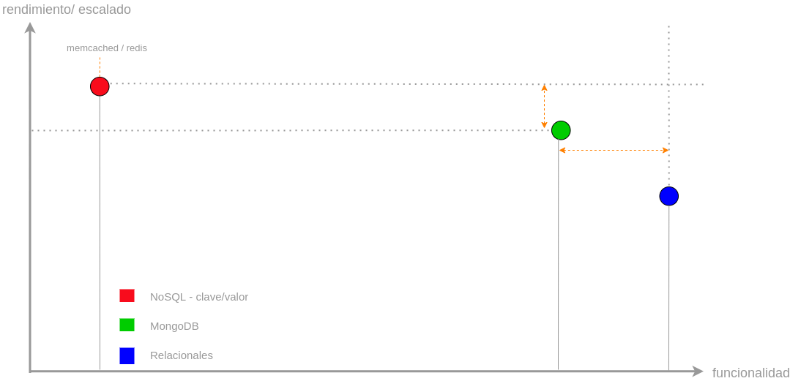
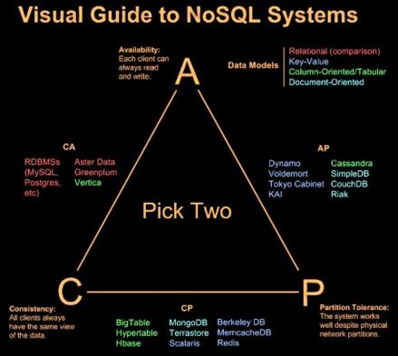

# Introducción a MongoDB

# Características generales

Los principales elementos que se manejan en MongoDB son colecciones y documentos. Por establecer una analogía con las BBDD relacionales, las colecciones jugarían un papel similar al de las tablas, y los documentos al de los registros. Sin embargo, los documentos, son estructuras json y las colecciones almacenan dichos documentos, cuyas estructuras dentro de una misma colección, pueden ser distintas.

Entre las ventajas que aporta MongoDB respecto a de las BBDD tradicionales, encontramos:

* el mapeo entre las estructuras de BBDD y software es más sencillo, pudiendo ser directo.
* Escalado:
  * MongoDB está preparado para asumir escalado horizontal de forma automática
  * mantiene el rendimiento frete a escalados horizontales
* Índices
  * se pueden crear índices de cualquier campo
  * alto rendimiento mediante índices
* Alta disponibilidad
  * La estructura básica suele estar compuesta de un servidor primario y dos secundarios. El primario suele actuar como fachada del sistema, recibe todas las operaciones, y los secundarios, de forma asíncrona, le preguntan por las operaciones que tienen pendiente de consumir.
  * Por defecto tanto las lecturas como las escrituras se hacen desde el primario, pero puede estar configurado de otra forma.
  * Por este motivo se podrían realizar lecturas sucias. Si se pregunta a alguno de los servidores secundarios por alguna información disponible en el primario, pero que no está actualizada en el secundario
  * Es este tipo de estructura, y la capacidad de reorganización de los servidores, lo que hace que sea un sistema con capacidad para recuperarse de fallos. Si por ejemplo el servidor primario se cae, esa responsabilidad es asumida por uno de los servidores secundario, y una vez resuelta la indisponibilidad, el servidor se vuelve a incorporar al sistema como secundario.

## Big Data, NoSQL, MongoDB

El motivo por el que surgen este tipo de BBDD es porque la naturaleza del dato, con la evolución de internet y los dispositovos conectados a esta, ha cambiado. Fundamentalmente, es el conjunto de tres características lo que hace insuficientes a las BBDD relacionales para trabajar afrontar este nuevo escenario. En concreto hablamos de:

* volumen. Cantidad de datos a almacenar
* variedad. La estructura del dato a almacenar presenta variedad
* velocidad. A la que hay que ingestar la información en la BBDD

En general, las BBDD relacionales funcionan bien frente a un tipo de escalado vertical, pero no frente a uno horizontal. Y es éste último el que mejor se adapta a este tipo de características.

Las nuevas BBDD que surgen para solucionar este tipo de problema, se agrupan bajo el nombre NoSQL, que habría que traducir como "no solo SQL". 

Es dentro de este contexto, donde MongoDB pretende establecer un compromiso entre funcioalidad, rendimiento y escalado:

Aunque presenta un poco menos de rendimiento o escalado, ganamos en funcionalidad. Aumenta el rendimiento a costa de perder la capacidad de hacer joins y transacciones como las BBDD relacionales.

Sin embargo, este inconveniente se solventa de forma relativa. ES cierto que no se pueden hacer joins, pero también lo es que toda la información necesaria para un documento, debería guardarse con él. Por otro lado, y aunque no hay transacciones, si aporta operaciones atómicas para los documentos, es decir que si se van a hacer modificaciones en un documento, éstas ser harán para todos los campos, o para ninguno.

## Teorema CAP

El teorema CAP, también llamado conjetura de Brewer, trata de clasificar los sistemas distribuidos, no solo las BBDD.

Intenta medir el grado de cumplimiento de 3 variables:

* **(C) consistencia**. El sistema deve devolver la misma información ante peticiones simultáneas del mismo dato.
* **(A) disponibilidad**. El sistema debe contestar a todas las peticiones que reciba
* **(P) tolerancia a la partición**. En un sistema distribuido, que pueden estar separados geográficamente, puede haber fallos de comunicación. Particiones en el sistema

Lo que dice el teorema es que un sistema distribuido, solo puede proporcionar dos de estas variables al mismo tiempo.

MongoDB en su sistema de funcionamiento por defecto es CP, proporciona consistencia y tolerancia a la partición. en grado máximo. También proporciona disponibilidad, pero lo hace en un grado inferior a las otras dos.

A continuación se muestra una pequeña clasificación de las principales BBDD del mercado según el teorema CAP

El motivo por el que Mongo ofrece consistencia, es porque en su arquitectura básica, el servidor primario siempre es responsable del acceso a las operaciones de escritura y lectura, de forma que hasta que no haya terminado con la escritura, siempre va a mostrar la lectura anterior.

Solo en caso de que se cambie la configuración para admitir lecturas de los servidores secundarios, se perdería consistencia. En este caso, se proporcionaría una consistencia eventual, y su clasificación sería más bien AP, porque se sacrificaría consistencia por disponibilidad.

