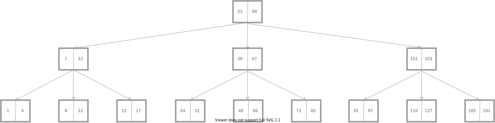

# Indices

Se trata del elemento fundamental para incrementar el rendimiento de las operaciones ejecutadas en MongoDB. La diferencia entre trabajar con ellos o no, es que si no se crean índices, para encontrar un documento en la colección, hay que escanearla entera, mientras que los índices la ordenan por el campo indicado, de forma que al buscar por dicho campo no es necesario escanear toda la colección.

Los índices en mongo, tienen una estructura B-Tree. Cuyo aspecto es del siguiente tipo:

El patrón de búsqueda siempre es rama izquierda si el valor de búsqueda es menor que el del índice izquierdo, rama derecha si el valor es mayor que el índice derecho. Cada uno de los índice apunta a un elemento de la colección

Entre sus ventajas:

* son más rápidos
* ocupan menos que la colección
* el caso óptimo de utilización de un índice se denomina **_consulta cubierta_**. Se da cuando se consulta por un campo del índice y se quieren recuperar otros campos que forman parte del índice. Cuando se recorre el árbol-b no hace falta acceder al documento a la que apunta el índice, todo está en el índice.
* si el campo del índice es de tipo array, se le concoce como multiclave, ya que cada una de las entradas del array será un índice.
* cualquier colección mongo tiene un índice implícito en el campo _id
* se pueden crear índices sobre campos de un subdocumento.

## Índices tipos y opciones de gestión

* único. No puede repetirse en dos docuemntos el mismo valor par el campo índice
* único compuesto. No puede repetirse la combinación de valores en ningún documento.
* disperso. Este tipo de índice se da cuando se crea un índice sobre campos del documento que pueden no existir. Para los documentos en los que no existe el campo, el índice para ese documento, no tiene entrada. Esto es importante, porque se pueden obtener resultados no deseados. Por ejemplo si se piden todos los resultados de una colección y ordenarlos por un campo presente en un índice disperso, en el resultado no apareceran los documentos que no tengan ese campo.
* Índice TTL (Time To Live). Son índices creados para que los documentos insertados en una colección se eliminen pasado un tiempo. Hay dos formas de definirlos:
  * se crea un índice sobre un campo fecha, y cuando se alcanza esa fecha se elimina el docuemnto
  * la otra opción es eliminar el documento pasado un espacio de tiempo.
* En segundo plano. Durante la creación de índices la colección queda bloqueada, con los índices en segundo plano se evita esto. Sin embargo, la creación del índice es más lenta y ocupa más espacio en disco.
* Eliminar duplicados. Esto ocurre cuando se quiere crear un índice en una colección ya existente, para la que existen valores de clave duplicados. La forma de solucionarlo es eliminándolos. El problema de esta opción es que mongo lo hace de forma aleatoria, es decir a priori no se puede saber con qué documento se va a quedar.

# Cuándo se usan los índices

* En el caso de índices compuestos:
  * si se consulta por todos los campos que componenen el índice
  * mongo también utiliza los índices en las queries en las que se pregunta por un subconjunto de los campos que están al principio del índice. Por ejemplo en una colección cuyo índice estuvise compuesto por "nombre", "apellido" y "dirección", si hiciésemos una consulta solo por el campo "nombre", o solo por los campos "nombre" y "apellido", mongo utilizaría el índice, no así si consultásemos por "apellido" y "dirección".
* **si se puede utilizar uno de los campos que compone el índice aunque no forme parte de un subconjunto inicial, como criterio de ordenación**

# Qué indice se usa

Esto afecta a qué indice utilizar cuando se tienen varios en una colección. En general mongo siempre elige bien el índice que debe utilizar, pero existe la posibilidad de forzarle para que utilice uno en concreto.

