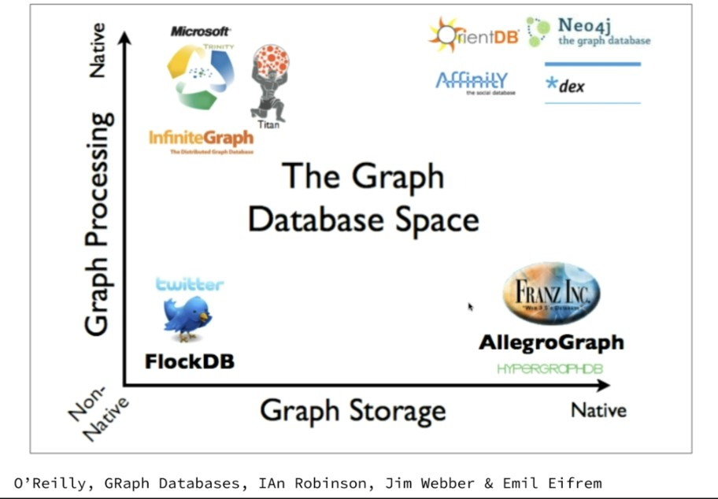

# Introducción

Un grafo es una colecciónd e vértices y aristas, cuyas propiedades son:

* Los nodos tienen propiedades clave-valor
* Los nodos pueden ser etiquetados con una o más etiquetas
* Las relaciones son nombradas y dirigidas (siempre tienen un nodo de inicio y otro de fin)
* Las relaciones pueden tener propiedas

Se trata de una forma de representar el mundo natuaral, en la que se abstraen los elementos y las relaciones entre ellos, que permite un procesamiento es rápido y eficiente por las conexiones entre los datos.

De una manera más formal, podemos decir que:

* **Grafo**: G = (V, A) donde V es un conjunto de vértices conectados por un conjunto de aristas A.
* **Vértice**: un punto en un gráfico donde cero o más bordes se encuentran, también conocido como un nodo o una entidad.
* **Arista**: una relación entre dos vértices dentro de un gráfico, a veces llamado relación, enlace o conexión.

Además del rendimiento, otra de las ventajas de los grafos, es que son fáciles de ilustrar, y por lo tanto más fácil de interpretar.

## BBDD

Un BBDD orientada a grafos, es la que almacena estructuras de datos con topología de grafo, y permite adminsitrarlas, generalmente mediante operaciones CRUD.

Cumple los siguientes criterios:

* El almacenamiento está optimizado para que los datos sean representados como un grafo.
* El almacenamiento está optimizado para el recorrido del grafo, sin usar un ı́ndice al seguir las aristas. Una BDoG está optimizada para consultas aprovechando la proximidad de los datos, comenzando desde uno o varios vértices raı́z, en lugar de consultas globales.
* Modelo de datos flexible para algunas soluciones: no es necesario declarar tipos de datos para vértices o aristas.
* API integrado con puntos de entrada para los algoritmos más clásicos de la teorı́a de grafos.

Fueron creadas bajo el paradigma OLTP (online transaccion processing). Aunque pueden ser administradas en local. Tienen dos propiedades fundamentales:

* The underlying storage
  * Se refiere al tipo de almacenamiento que podemos encontrar:
    * Nativa, los grafos no se interpretan
    * Los grafos son interpretados como objetos y se almacenan en BBDD relacionales. En este segundo caso el rendimiento es peor.
* The processing engine
  * index-free adjacency
    * Los nodos se conectan físicamente unos a otros. Este tipo de almacenamiento incrementa el rendimiento. Es importante si pensamos que podemos tener millones de nodos y relaciones.

En el siguiente gráfico se puede observar una comparativa de diferentes tipos de BBDD orientadas a grafos, según procesamiento y almacenamiento subyacente:

