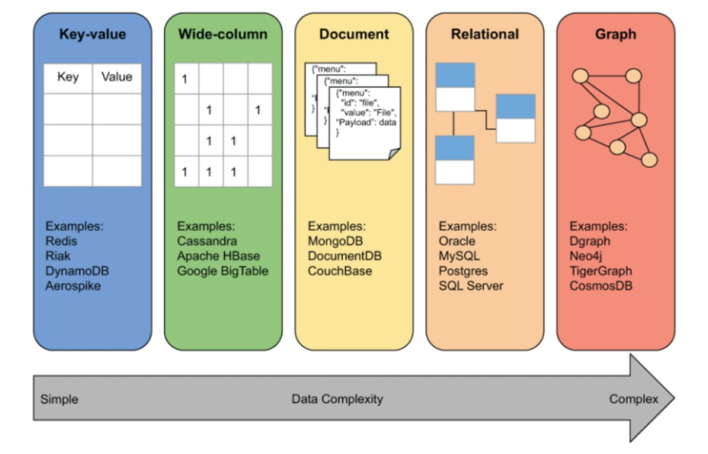

# Introducción

Las categorías principales de BBDD NoSQL son:

* Clave Valor
* Columnares
* Orientadas a Documentos
* Orientadas a grafos (BDoG)

Solo los dos últimos tipos de BBDD tienen la capacidad de relacionar entidades de entre los datos almacenados. Para el resto es posible, pero con mejoras específicas del proveedor.

Sin embargo, las relaciones existen en la base de datos relacionales, pero solo en el momento del modelado. En el momento de unir las tablas estas relaciones desaparecen y quedan expresadas en restricciones de claves foráneas4 para mantener la validez de los datos, pero no queda la relación plasmada en el modelo fı́sico. De esta manera la gran mayorı́a de consultas deben proyectar de varias tablas (JOIN) con estrategias diversas para obtener los datos.