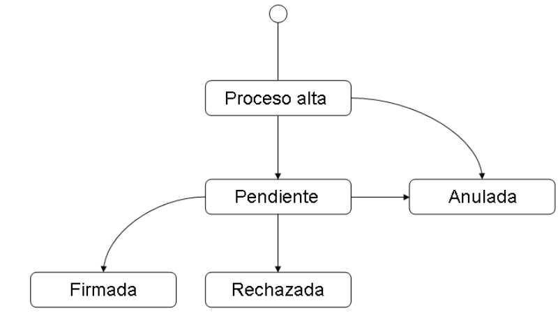

# Docel Web

* IGPF Integración general del portafirmas
* Interfaz generica de portafirmas
  * Definición de las operaciones que iba a soportar  * 
  * Implementada mediante servicios web
  * Procedimiento asíncrono basado en dos sistemas:
    * Sistema de gestión --> genera la solicitud de firma
    * Sistema de portafirmas --> el usuario realiza acciones de revisión y firma, o rechazo de la solicitud
    * Las llamadas y callbacks entre ellos son asíncronos, permitiendo independizar los flujos del procedimiento adminsitrativo de los flujos del sistema.
    * Adicionalmente se independiza el concepto de documento del de firma, ya que el usuario puede recibir la documentación necesaria para el trámite, pero solo algunos de los docuemntos pueden requerir firma.
    * Teniendo en cuenta lo anterior, las solicitudes se pueden encontrar en varios estados:
      * proceso de alta --> solicitud en proceso de registro
      * pendiente de firma --> se ha terminado el registro
      * firmada --> Los documentos que requieren firma están firmados y se devuelven al sistema gestor
      * rechazada --> el firmante no desea firmar alguno de los documentos de la solicitud
      * anulada --> la aplicación de gestión notifica a la aplicación del portafirmas la anulación de la solicitud. Solo se puede llegar a ella desde el estado de pendiente.
  
  
* Operaciones portafirmas:
  * comenzar solicitud
    * requiere un documento para firmar
  * registrar documentos
  * consultar documetnos
  * registrar solicitud
    * grabar y enviar (en el buzon de entrada)
  * consultar estado solicitud
  * consultar solicitud
  * anular solicitud
* Tecnología envío ficheros:
  * codificados en base64
  * mtom

## Docel Web
* Se conecta con otros sistemas de informática presupuestaria por mediao de IGPF
* Está dividido en:
  * Bandeja de entrada (solicitudes)
  * Bandeja de salida (devueltas, enviadas o archivadas)
  * visor de documentos
* firma de ficheros formato xades, mediante applets
* gestión de firmas de documentos durante procedimientos de tramitación de la administración
* portafirmas electronico arquitectura web
    * accesible desde dispositivos con SO Android iOS.
    * ¿firma trifásica en diferido?    
    * applet extraligero SGIFE 
    * MiniApplet @Firma Internet 8 o superior.
    * autofirma -- chrome y firefox
* Formatos de documentos admitidos:
    * pdf
    * xml
    * txt
    * xsig
    * doc - docx
    * zip

* permite tramitar solicitudes de firma de aplicaciones internas o externas
    * Secretaría de estado de presupuestos y gastos    
    * IGAE
    * usuarios externos que requieran relacion con las administraciones
* App @Firma
    * escritorio
    * móvil (yo salí antes de que se pusiese en producción)
* Validae