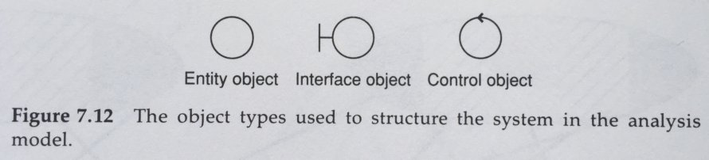

# Arquitectura EBI (Entidad-Limite-Interactor)

Aunque dada a conocer por Robert C. Martin, el patrón fue publicado por Ivar Jacobson en 1992. Originalmente era Entidad-Interfaz-Control, pero se cambió su nombre para no confundirlo con elementos de lenguajes de programación.

## Entity 

Este tipo de objetos contienen todos los datos utilizados por el sistema y el comportamiento acoplado a eestos datos. Cada entidad representa un concepto relevante dentro del dominio del problema, y mantiene la identidad de los datos persistentes. 

Adicionalmente, Jacobson indica que que la naturaleza de la lógica que debe contener la entidad, es tal, que si la estructura de los datos que contiene cambia, las operaciones sobre estos datos también tendrán que cambiar. Por eso deben estar ubicados juntos.

Esta recomendación va en contra de lo que actualmente se conoce como entidades anémicas.

## Boundary (interfaz)

Modelan todas las interfaces con el sistema. Toda la funcionalidad dependiente del entorno del sistema, pertenece a este tipo de objetos. En otras palabras, cualquier interacción del sistema con un actor, debe pasar por un objeto Boundary.

**_Es sin duda de este concepto del que surge el actual de puertos y adaptadores._** A nivel de arquitectura, su responsabilidad es la misma. 

## Interactor (control)

Los objetos interactor, según Jacobson son aquellos que orquestan un caso de uso, así como los objetos que contengan un comportamiento relevante para éste y que no sean una entidad o una interfaz.

A su vez H Graca, los compara con los Servicios de Aplicación (que orquestan casos de uso) y servicios de dominio (que contienen el comportamiento de dominio que no recae en entidades.)

La relevancia de éste último tipo de objetos es muy importante, ya que si la comunicación entre interfaces y entidades fuese directa, éstas últimas podrían acabar condicionando su lógica a los actores externos con los que se comunican.

## Conclusión

Como conclusión, se puede añadir que este tipo de especialización de objetos que identificó Jacobson, responde claramente al principio de responsabilidad único, en el que cada elemento debe tener un único motivo (o agente externo) que justifique sus cambios.

Según el propio Graca:

_Del mismo modo que en el patrón MVC el Modelo representa todo el back-end, todas las entidades, servicios y sus relaciones, el patrón EBI ve el Límite como una conexión completa con el mundo exterior y no sólo una vista, un controlador o una interfaz (la construcción del lenguaje). El Boundary representa toda la capa de presentación que en MVC corresponde a la Vista y al Controlador. La Entidad en EBI representa las Entidades reales que contienen datos y su comportamiento asociado, mientras que los objetos Interactores hacen la conexión entre la capa de presentación y las Entidades, son lo que yo llamaría Servicios de Aplicación y Servicios de Dominio._

_El patrón EBI es para el back-end lo que MVC es para el front-end. No son una alternativa el uno al otro, son complementarios. Si los juntáramos en un solo patrón podríamos llamarlo algo así como Vista-Controlador-Interactor-Entidad._

_Traducción realizada con la versión gratuita del traductor www.DeepL.com/Translator_