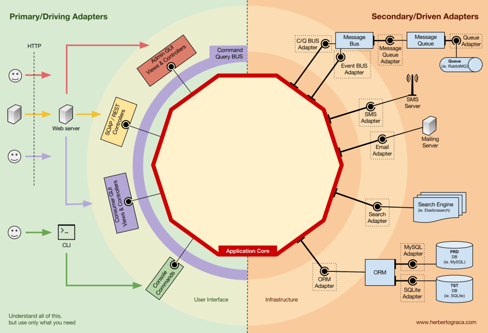

# Estructura

La arquitectura de puertos y adaptadores, identifica explícitamente tres bloques fundamentales de código de un sistema:

* aquello que permite ejecutar una interfaz de usuario
* la lógica de negocio del sistema o núcleo de la aplicación.
* el código de infraestructura que conecta el núcleo con las tecnologías de backend.

Un ejemplo puede ser el siguiente:

## Capa de aplicación

Los casos de uso se definen en la Capa de Aplicación, la primera capa proporcionada por DDD y utilizada por la Arquitectura Onion.

Los casos de uso son los procesos que pueden ser desencadenados en nuestro 
Núcleo de Aplicación por una o varias Interfaces de Usuario.

Por lo tanto esta capa contiene los Servicios de Aplicación (y sus interfaces), puertos y adaptadores. 

Según Graca, su relación con la capa de dominio es:

* utilizar un repositorio para encontrar una o varias entidades
* decirle a esas entidades que hagan alguna lógica de dominio
* y utilizar el repositorio para persistir las entidades de nuevo, guardando efectivamente los cambios de datos.

**_yo no acabo de ver claro que esto sea así_**

## Capa de dominio

Contiene los datos y la lógica de manipulación de éstos. Es independiente de los procesos de negocio que desencadenan la lógica y ajenos a la capa de aplicación.

### Servicios de dominio

Fundamentalmente, se trata de la lógica que vincula las entidades del dominio, pero que no es intrínseca a ellas. 

Por lo tanto, los servicios de dominio, no deberían saber nada de la capa de aplicación o la infraestructura, pero si puede tener conocimiento de otros servicios de dominio o de los objetos de modelo de dominio

### Modelo de dominio

El modelo de dominio no depende de nada externo, y contiene los objetos que dan identidad al negocio.Hexagonal Architecture by example - a hands-on introduction Estos objetos son entidades, objetos valor, enums, y cualquier otro objeto necesario. También es donde se ativan los eventos de dominio cuando se produce una regla que lo desencadena

## Componentes 

Hasta este punto, se ha mencionado los elementos de grano fino implicados en una arquitectura hexagonal, pero la segregación de código de grano fino también implica la segregación de grano grueso, que trata de segregar el código según subdominios y contextos delimitados. 

Esto implica paquetes por características o paquetes por componente, en contraposición al paquete por capa. (Robert C. Martin - [screaming architecture](https://blog.cleancoder.com/uncle-bob/2011/09/30/Screaming-Architecture.html) y también Simon Brown en [paqute por componente y pruebas alineadas con arquitectura](http://www.codingthearchitecture.com/2015/03/08/package_by_component_and_architecturally_aligned_testing.html)). [Artículo estructura por componentes](./paquete_componente.md)

Dichas secciones de código son transversales a las capas descritas, tales como autenticación, autorización, etc., pero siempre relacionadas con el dominio. **_Pero no debemos olvidar que los componenes se benefician también de un bajo acoplamiento y alta cohesión como los elementos de grano fino_**. 

Un componente desacoplado, significa que no tiene conocimiento de otros componentes, es decir no tiene ninguna referencia a ninguna unidad de código de otro componente, ni tan siquiera a las interfaces. Esto significa que ni la inyección de depencencias ni la inversión de dependencias (que la clase dependa de abstracciones o interfaces) son suficientes para desacoplar componentes. Por este motivo se necesita algún tipo de elemento de arquitectura como eventos, núcleo compartido, conssistencia eventual, servicios de descubrimiento, etc.

Sin embargo, podemos hacer que A utilice un despachador de eventos para enviar un evento de aplicación que será entregado a cualquier componente que lo escuche, incluido B, y el oyente de eventos en B desencadenará la acción deseada. Esto significa que el componente A dependerá de un despachador de eventos, pero estará desacoplado de B.

El inconveniente, es que si el evento en sí "vive" en A, esto significa que B conoce la existencia de A, y está acoplado a A. 

Para eliminar esta dependencia, se puede crear una biblioteca con un conjunto de funcionalidades del núcleo de la aplicación que será compartido entre todos los componentes, el Kernel Compartido. 

Esto significa que los componentes dependerán del Kernel Compartido pero estarán desacoplados entre sí. El Kernel Compartido contendrá funcionalidad como eventos de la aplicación y del dominio, pero también puede contener objetos de Especificación, y cualquier cosa que tenga sentido compartir, teniendo en cuenta que debe ser lo mínimo posible porque cualquier cambio en el Kernel Compartido afectará a todos los componentes de la aplicación. 

Además, si tenemos un sistema políglota, digamos un ecosistema de microservicios donde están escritos en diferentes lenguajes, el Kernel Compartido necesita ser agnóstico al lenguaje para que pueda ser entendido por todos los componentes, sea cual sea el lenguaje en el que hayan sido escritos.Por ejemplo, en lugar de que el Kernel Compartido contenga una clase de Evento, contendrá la descripción del evento (es decir, el nombre, las propiedades, tal vez incluso los métodos, aunque estos serían más útiles en un objeto de Especificación) en un lenguaje agnóstico como JSON, para que todos los componentes/micro-servicios puedan interpretarlo y tal vez incluso auto-generar sus propias implementaciones concretas.

Este enfoque funciona tanto en aplicaciones monolíticas como en aplicaciones distribuidas como ecosistemas de microservicios. Sin embargo, cuando los eventos sólo pueden ser entregados de forma asíncrona, para contextos en los que la lógica de activación en otros componentes debe hacerse inmediatamente, este enfoque no será suficiente. El componente A tendrá que hacer una llamada HTTP directa al componente B. En este caso, para tener los componentes desacoplados, necesitaremos un servicio de descubrimiento al que A preguntará dónde debe enviar la solicitud para desencadenar la acción deseada, o alternativamente hacer la solicitud al servicio de descubrimiento que puede proxy al servicio relevante y eventualmente devolver una respuesta al solicitante. Este enfoque acoplará los componentes al servicio de descubrimiento, pero los mantendrá desacoplados entre sí.

Otros aspectos que se deben tener en cuenta a la hora de compartir información entre componenetes, es que: Cuando un componente necesita utilizar datos que pertenecen a otro componente, digamos que un componente de facturación necesita utilizar el nombre del cliente que pertenece al componente de cuentas, el componente de facturación contendrá un objeto de consulta que consultará el almacenamiento de datos para esos datos. Esto significa simplemente que el componente de facturación puede conocer cualquier conjunto de datos, pero debe utilizar los datos que no le "pertenecen" como de sólo lectura, por medio de consultas

La consecuencia inmediata de este planteamiento, es que será solo el propietario de los datos el que podrá cambiarlos. El resto de componentes podrán utilizar solamente una copia local de los mismos.

Buscando he encontrado varias propuestas sobre cómo estructurar el código:

* [Auntentia: Francisco Acebes](https://github.com/aacebes/Architectures)
* [Pandemonio digital](https://pandemoniodigital.es/arquitectura/2020/12/21/arquitectura-hexagonal-spring-boot.html)
* [Mesa Redonda: arquitectura hexagonal](https://leanmind.es/es/blog/mesa-redonda-arquitectura-y-organizacion-de-directorios/)
* [Hexagonal Architecture by example - a hands-on introduction](https://blog.allegro.tech/2020/05/hexagonal-architecture-by-example.html)

Probablemente la más purista de todas sea la última, me parece que respeta los principio descritos en arquitectura hexagonal, pero la propuesta de *_Mesa Redonda_* me parece muy interesante. 

En el repositorio de Autentia hay aproximaciones a tipos de propuestas de arquitectura, y en pandemonio digital se enfrentan alguna propuestas.