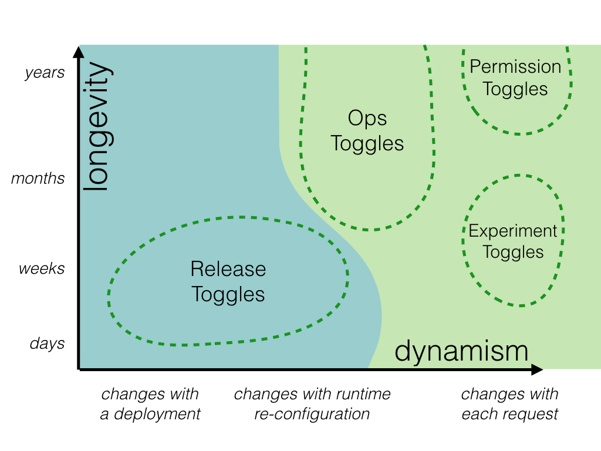

# Feature Toggle

Feature Toggle es una técnica que permite cambiar el comportamiento del software sin cambiar el código, identificando de forma dinámica qué comportamiento es el que está activo. 

El objetivo es hacer que la Feature Toggle, tome decisiones basadas en una configuración específica del entorno. Idealmente, permite activar un nueva funcionalidad en un entorno cuando se considere adecuado.

## Categorías

Las **feature toggle** pueden clasificarse de acuerto a dos categorías principales:
  * la duración de la conmutación de funciones 
  * el dinamismo de la decisión de conmutación. 
  
* Release Toggles

Permiten enviar nuevos flujos al entorno de producción como código latente, que puede ser activado o no, pero no interfiere con otras funcionalidades.

Es útil en entornos de desarrollo en los que se practica entreaga contínua, ya que  permiten integrar nuevas funcionalidades en una rama de trabajo compartida (por ejemplo, master o trunk) y desplegar simultáneamente otras funcionalidades a producción, sin que éstas segundas se vean afectasdas por las primeras. 

* Exmperiment Toggles

Los Toggles de Experimento se utilizan para realizar pruebas multivariadas o A/B. Cada usuario del sistema es colocado en una cohorte y en tiempo de ejecución el router Toggle enviará consistentemente a un usuario dado por un codepath o el otro, basado en la cohorte en la que se encuentra

Al rastrear el comportamiento agregado de diferentes cohortes se puede comparar el efecto de cada una de las rutas de código. Esta técnica se utiliza comúnmente para hacer optimizaciones basadas en datos a cosas tales como el flujo de compra de un sistema de comercio electrónico, o el texto de la llamada a la acción en un botón.

* Ops Toggles

Se utilizan para controlar los aspectos operativos del comportamiento de nuestro sistema. Se puede introducir una Ops Toggle cuando se lanza una nueva característica que tiene implicaciones de rendimiento poco claras para que los operadores del sistema puedan desactivar o degradar esa característica rápidamente en producción si es necesario.

* Permissioning Toggles

Este tipo de toggle se utiliza para cambiar las características o la experiencia del producto que reciben ciertos usuarios. Por ejemplo, se pueden tener un conjunto de características "premium" que sólo se activan para un tipo de clientes. 

O tal se tenga un conjunto de características "alfa" que sólo están disponibles para los usuarios internos y otro conjunto de características "beta" que sólo están disponibles para los usuarios internos más los usuarios beta. Esta técnica de activar las nuevas características para un conjunto de usuarios internos se denomina __Champagne Brunch__,  una oportunidad temprana para "beber su propio champán".

Un Champagne Brunch es similar en muchos aspectos a un Canary Release. La diferencia entre ambos es que una función Canary Released se expone a una cohorte de usuarios seleccionada al azar, mientras que una función Champagne Brunch se expone a un conjunto específico de usuarios.

## Elección de tipo de Toggle

Las Toggles que toman decisiones de enrutamiento en tiempo de ejecución son más sofisticadas, ya que necesitan una configuración más compleja.

Para decisiones simples, se puede utilizar un enrutamiento estático, basado en una configuración de toggle On o Off, un router responsable de transmitir ese estado estático de on/off al punto de decisión.

También se pueden dividir las categorías de conmutación en aquellas que son esencialmente de naturaleza transitoria frente a las que son de larga duración y pueden estar en funcionamiento durante años. Esta distinción debe tenerse en cuanta a la hora de implementar la toggle. Algunas estrategias a la hora de implementarlas pueden ser:

* Desacoplar puntos de decisión de la lógica de decisión.
* Inversión de control
* Evitación de condicionales (patrón estrategia)

## Configuración del Toggle

Una Toggle puede configurarse de diferentes maneras:

* Configuración hardcodeada. La decisión de entrutamiento se toma en **Tiempo de compilación**. **requiere redespliegue o inicio del proceso**.
* Configuración parametrizada - variables de entorno o línea de comandos. **requiere redespliegue o inicio del proceso**
* Fichero de configuración
  * Permite reconfigurar una toggle simplemente cambiando ese archivo en lugar de reconstruir el código de la aplicación en sí. Sin embargo, aunque no es necesario reconstruir la aplicación para activar una función, en la mayoría de los casos es probable que tengas que volver a desplegar la aplicación para reconfigurar un indicador.
* Configuración en BBDD.  Suele requerir la creación de algún tipo de interfaz de usuario de administración que permita a los operadores de sistemas, probadores y gestores de productos ver y modificar los indicadores de características y su configuración.
* Configuración distribuida. La diferencia con la anterior es que se usa una base de datos de propósito general que forma parte de la arquitectura del sistema para almacenar la configuración. Sin embargo, hoy en día hay una serie de almacenes jerárquicos de valores-clave de propósito especial que se adaptan mejor a la gestión de la configuración de las aplicaciones: servicios como Zookeeper, etcd o Consul. Estos servicios forman un clúster distribuido que proporciona una fuente compartida de configuración del entorno para todos los nodos conectados al clúster. La configuración puede ser modificada dinámicamente siempre que sea necesario, y todos los nodos del clúster son informados automáticamente del cambio. [Spring Consul](https://cloud.spring.io/spring-cloud-consul/reference/html/)
* Sobrescritura de la configuración. La realidad de muchos sistemas es más sofisticada, con capas de configuración anuladas que provienen de varias fuentes. En el caso de Toggle Configuration es bastante común tener una configuración por defecto junto con anulaciones específicas del entorno. Estas anulaciones pueden provenir de algo tan simple como un archivo de configuración adicional o algo sofisticado como un clúster 
* Sobrescritura por petición. Un enfoque alternativo a las anulaciones de configuración específicas del entorno es permitir que el estado de activación/desactivación de un conmutador se anule por solicitud mediante una cookie especial, un parámetro de consulta o una cabecera HTTP. Esto tiene algunas ventajas sobre la anulación de la configuración completa.
  * Si un servicio tiene un equilibrio de carga, la anulación se aplicará independientemente de la instancia de servicio a la que acceda. 
  * También puede anular los indicadores de características en un entorno de producción sin afectar a otros usuarios
  * Si el mecanismo de anulación por solicitud utiliza cookies persistentes, entonces alguien que pruebe tu sistema puede configurar su propio conjunto personalizado de anulaciones de alternancia que permanecerá aplicado de forma consistente en su navegador.
  
  La desventaja de este enfoque por solicitud es que introduce el riesgo de que los usuarios finales curiosos o malintencionados puedan modificar el estado de las funciones por sí mismos. 
  
## Ideas problemas

* Cambiar toggle dinámicamente por variable en BBDD
  * cambiar instancia spring
    * ventaja: para las dependencias es transparente que tipo de instancia están utilizando (patrón bridge)
    * desventaja: no se puede cambiar el comportamiento de varios componentes de forma escalonada. Al cambiar la instancia en el contexto se cambia para todos.

## Referencias

* https://martinfowler.com/articles/feature-toggles.html
* https://www.baeldung.com/spring-reloading-properties

* https://thepracticaldeveloper.com/practical-guide-feature-toggles-spring-boot/
* https://reflectoring.io/spring-boot-feature-flags/
* https://stackoverflow.com/questions/54890534/database-driven-feature-toggle
* https://www.linkedin.com/pulse/feature-toggle-implementation-using-spring-boot-jonnabhatla
* https://onix-systems.com/blog/introduction-to-feature-flags-in-java-using-the-spring-boot-framework
* https://reflectoring.io/spring-boot-feature-flags/
* https://thepracticaldeveloper.com/practical-guide-feature-toggles-spring-boot/
* https://www.javacodegeeks.com/2018/03/feature-toggle-in-spring-boot-2.html
* https://www.baeldung.com/spring-feature-flags
* https://www.cloudbees.com/blog/spring-feature-toggle
* https://medium.com/@AADota/togglz-feature-toggles-pattern-for-java-spring-25142990c224
* https://morioh.com/p/d300da676dbe
* https://dzone.com/articles/togglz-with-spring-boot-integration?ref=morioh.com&utm_source=morioh.com
* [Cambio de instancia spring en tiempo de ejecución](https://reflectoring.io/spring-bean-lifecycle/) 
* [Bridge Pattern - para cambio de instancia en tiempo de ejecución](https://springframework.guru/gang-of-four-design-patterns/bridge-pattern/)
* [Eventos para identificar el cambio de toggle](https://www.baeldung.com/spring-events)
* https://apiumhub.com/es/tech-blog-barcelona/beneficios-feature-toggles-feature-flags/
