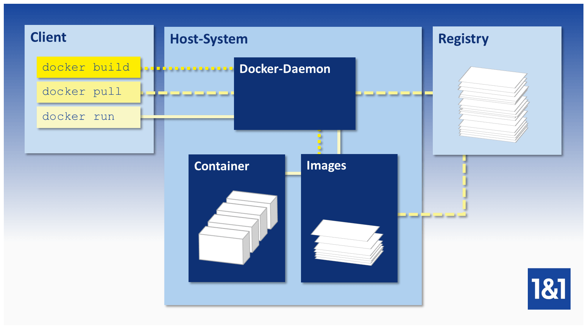

# Introducción

Cosas que no es docker:

* no es un gestor de entornos virtuales de desarrollo como vagrant
* no es un softwarede virtualización (kvm, xen, vmware)
* no es un gestor de configuración (puppet, chef, ansible)
* no es solo un gestor de contenedores (lxfc)

Docker es un ecosistema para:

* gestión de contenedores
* gestión de imágenes
* distribución de imágenes
* permite montar entornos de desarrollo
* ejecutar aplicaciones de forma aislada e independiente del entorno

La diferencia entre docker y un sistema de virtualización es que el segundo carga un sistema operativo completo en memoria. De forma que si hay 6 servidores de aplicaciones corriendo, necesitariamos 6 sistemas operativos ejecutándose a la vez (memoria). Pero además necesitamos todo el soporte físico para ello.

Sin embargo Docker no necesita tener todo el sistema corriendo en memoria, las aplicaciones se ejecutan como procesos aislados dentro de un mismo sistema, haciendo una virtualización por contenedores. No se crea un sistema huésped completo ya que los contenedores comparten el mismo kernel. Esta filosofía permite aislar unas aplicaciones de otras, sin quer necesiten asumir la sobrecarga de un sistema huésped separado.

En consecuencia, hace que sea una tecnología adecuada para la escalabilidad, alta disponibilidad y portabilidad, ya que además de ahorrar recursos frente a la virtualización, permite instalar aplicaciones multiplataforma en diferentes infraestructuras, sin necesidad de crear una configuración específica para el hardware o software del host. Lo hace mediante imágenes, que son copias portables para instalar en los contenedores, ya que contienen bibliotecas, binarios y recursos que necesitan las aplicaciones.

Su arquitectura está compuesta de los siguientes elementos:

Y en cuanto a su cómo se organiza un contenedor, se puede ver en la siguiente imagen.

Docer utiliza el sistema de archivos en capas AuFS. Este sistema de archivos por capas, permite gestionar espacios de solo lectura y espacios de escritura, pero fusionarlos en ejecución. E

Es esta característica la que permite que los contenedores utilicen el mismo conjunto de librería o herramientas (imágenes),y distintas aplicaciones:

Además no solo se pueden crear contenedores con las mismas librerías y diferentes aplicaciones, sino que se puede hacer composición imágenes en un contenedor:

Un sistema virtualizado completo, tiene un conjunto de recursos asignaos y realiza intercambio mínimo, por lo que obtiene mucho aislamiento. Docker obtiene menos aislamiento, pero los contenedores son más ligeros.

## Ciclo de vida

Un contenedor solo vive mientras el proceso que ejecuta está vivo. Una vez finalizado, el contenedor se cierra. Por eso, si ejecutamos un contendor cuyo contenido es únicamente un sistema operativo, si éste no ejecuta ningún servicio, al finalizar se ccerrará, ya que no hay ningún proceso ejecutándose por defecto. 

## Comando básicos

* **docker run** : se usa para ejecutar un contenedor desde una imagen. Ejecutará una instancia de la imagen que se le indique en el host docker si ya existe. Si la imagen no está presente en el host, la descarga de Docker Hub. El software de la imagen correrá en primer plano. Si se quiere evitar la salida por consolo se puede ejecutar el contenedor en segundo plano con la opción -d “docker run -d imagen".

* **docker ps**: enumera todos los contenedores en ejecución y alguna información básica sobre ellos, como el ID del contenedor, el nombre de la imagen que utilizamos para ejecutar los contenedores, el estado actual y el nombre del contenedor. Para ver todos los contenedores aunque no estén ejecutandose, se debe usar la opción -a que lista todos los contenedores en ejecución, los parados y los finalizados.

* **docker stop** : seguido del identificador o del nombre de un contenedor, o su nombre, detiene su ejecucióin.

* **docker rm** : seguido del identificador del contendor o de su nombre, lo elimina permanentemente.

* **docker images**: muestra la lista de imágenes disponibles y sus tamaños.

* **docker rmi** : sirve para eliminar imágenes. Se debe detener y eliminar todos los contenedores dependientes para poder eliminar una imagen.
  
* **docker pull** : seguido del nombre de una imagen, la extrae del repositorio en el que se encuentre.

* **docker exec**: ejecuta un comando dentro del contenedor. Por ejemplo, imprimir el contenido del archivo /etc/hosts “docker exec contenedor_id cat /etc/hosts”. O si queremos ejecutar bash: "docker exec -t -i mycontainer /bin/bash"