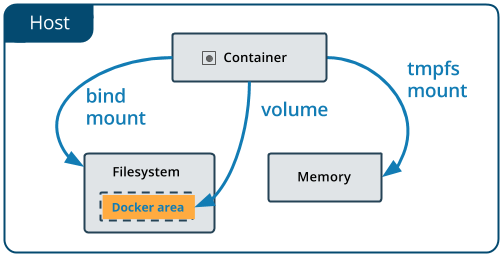

# Persistencia con volúmenes

En ocasiones, será necesario acceder a los procesos que corren en el contendor. Para poder hacerlo, Docker proporciona el comando exec:

```sh
docker exec CONTENEDOR_ID ls
```

Aunque probablemnte su uso más habitual, o más práctico, sea para ejecutar bash en el contenedor, desde el host. Para ello se ejecutará:

```sh
docker exec -it CONTENEDOR_ID bash
```

Si una vez dentro, se ejecuta:

```sh
tail -f /var/log/nginx/access.log
```

 Se podrá ver toda la actividad que se hace sobre el contenedor. Sin embargo hay que tener en cuenta que **cualquier cambio que se haga en el sistema del contenedor no va a persistir en las imágenes utilizadas para su creación, de forma que si se borra y se vuele a crear, los cambios se perderán.** Se trata pues de infraestructura, que por defecto es inmutable.

No obstante para algún tipo de infrastructura es necesario la existencia de contenedores persistentes. El comando:

```sh
docker volume
```

permite gestionar los volúmenes docker. En cada contenedor creado, se tiene asociado un volumen en el host que lo hospeda, donde se almacenará la información que se cree en el contenedor. En concreto, docker crea una carpeta en **/var/lib/docker/volumes** por cada contenedor en el host. Para poder listar los volúmenes existentes se ejecutará:

```sh
docker volume ls
```

Y para crear volúmenes nuevos:

```sh
docker volume create nombre_volumen
```

Para conocer los metadatos del volumen, se procede de la misma forma que para las imágenes y los contenedores:

```sh
docker volume inspect NOMBRE_VOLUMEN
```

Exiten tres tipos de almacenamiento en docker:



* **_volumes_**: los datos se almacenan dentro del sistema de ficheros del host. Es el mecanismo preferido para persistir los datos, y  **solo Docker tiene permisos sobre esta ubicación**. Un volumen puede ser montado por diferentes contenedores a la vez.
* **_bind mounts_**: Se utiliza para mapear cualquier sitio del sistema de ficheros dentro del contenedor. A diferencia de los volúmenes, este mecanismo permite acceder a la ruta mapeada y modificar los ficheros.
* **_tmpfs_**: Almacenamiento temporal en memoria, en general útil para el almacenamiento de configuraciones y datos que desparecerán cada vez que el contenedor se pare.

Los volúmente son importantes, porque pueden ser asignados a los contenedores en el momento de monarlos, esto se pued hacer con:

```sh
docker create -P --mount source=NOMBRE_VOLUMEN, target=target/var/www/html --name NOMBRE_CONTENEDOR IMAGEN_ID:TAG
```

Todo esto es importante, porque al utilizar este mecanismo se pueden editar los ficheros que utiliza el contendor desde el propio host, sin necesidad de acceder a éste, y porque si se borra el contenedor, los que éste utiliza, siguen existiendo en el host. Así se puede ir evolucionando en cuanto a imágenes (por ejemplo evolucionar la versión de BBDD y seguir utilizando los mismos datos), aumentar sus tags, y seguir utilizando los mismos datos.

Los volúmenes al igual que los contenedores y las imágenes se pueden eliminar con rm:

```sh
docker volume rm NOMBRE_VOLUMEN
```

Otro comando es prune:

```sh
docker volume rm prune
```

Que permite borrar volúmenes de forma masiva.
