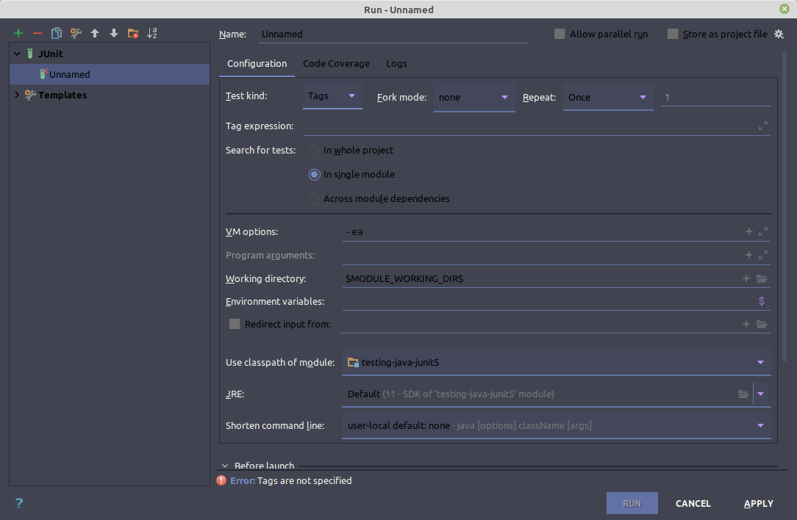

# TAG ANOTATION

Este tag, se puede utilizar para agrupar un conjunto de test en ejecución. Puede aplicarse tanto a una clase como a un interfaz. Intellij, permite mediante configuración de ejecuciones, que este se aplique a un único tag. 

En el caso de maven, hay que añadir el tag:                     

    <groups>
        model
    </groups>

al tag **configuration** del plugin surfire en el bloque build, donde model, es el nombre que se le ha dado al tag. Hay varias formas de combinarlos, mediante operadores maven, como or, and or not. Además existe un tag adicional, **exclude** que permite ejecutar todos los tags, menos los que se declaran en él.