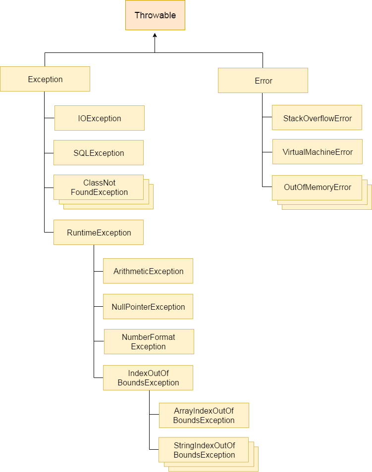

# Excepciones

En primer lugar, hay que entender los conceptos generales de las excepciones java:

## Jerarquía de excepciones java

* java.lang.Throwable es la clase base de todas las excepciones
* java.lang.Exception es la superclase de las excepciones, son los errores resultantes de la actividad del programa.
* java.lang.RuntimeException. Superclase de todas las excepciones normales que son excepciones sin marcar.
* Java.lang.Error. Es la superclase de todas las excepciones de "error fatal". Situaciones en las que la JVM considera inseguro o imprudente que una aplicación intentara recuperarse del error. Son errores de los que no es posible recuperarse.

**No es recomendable declarar subtipos personalizados de de Throwable**, ya que la mayoría de soluciones y librerías basadas en java consideran que Error y Exception son los únicos tipos que heredan de Exception.

## A tener en cuenta

En término generales, hay 3 situaciones que hacen que las excepciones sean lanzadas:

* excepciones que se producen en el **código cliente**. Utilización de APIS, parseo documentos json, xml, mala utilización JPA, etc.
* excepciones por **fallos de recursos**. Falta de memoria, caída de red
* **errores de programación**

y por lo menos dos categorías de excepciones:

* **Excepciones de negocio**. Deberían almacenarse en un sitio diferente a las excepciones de sistema.
  * Excepciones de permisos --> generalmente referido a intentos de realizar acciones sobre recursos de negocio.
* **Excepciones de aplicación**. De éstas últimas no habría que mostrarle los mensajes nativos al usuario.
  * Exepciones de seguridad --> cuando se trata de acceder a un recurso con acceso restringido para el que no se tienen permisos. (habría que registrar usuario, acción/recurso, fecha)

## Recomendaciones

### destinos

Hay que tener en cuenta a dónde queremos que sean dirigidas nuestras trazas para su almacenamiento final.

* ¿dónde queremos que nuestras trazas sean dirigidas?
* por cada destino, habrá que configurar un apender

### Buenas prácticas y recomendaciones de uso

* Almacenar los mensajes de error dentro de un fichero properties
* Registrar las excepciones en un log
* Definir niveles de prioridad
* Diseñar diversos formatos de salida de la información de excepciones
* **Las excepciones deben ser inmutables**. Sus campos deben estar definidos como final.
* no capturar nunca excepciones de tipo Throwable

### Información qeu debería mostrar

* En qué capa:
  * presentación
  * negocio
  * persistencia
* Qué tipo
  * entidades
  * interfaces
  * dao
  * servicio
  * vo
  * dto
  * util
  * controlador

## Requisitos

* Evitar que la ocurrencia de excepciones se muestre al usuario final en pantalla de forma incontrolada. **Esta parte está asgurada con el control de excepciones de Spring para los controladores**
* No perder información de las excepciones lanzadas a más bajo nivel en la aplicación. **Para mi esto implica que absolutamente todas las excepciones deben ser procesadas**
* Mantener un Log de todas las excepciones que ocurren en el sistema y que sea lo más legible posible. **¿Cuadra esto con la idea de notificación de martin fowler?**
Dar soporte al sistema de validaciones de la aplicación.
* La estrategia planteada deberá ser en líneas generales la siguiente:
  * Diseñar una jerarquía de excepciones especificando en qué casos se debe utilizar cada una de ellas.
  * Establecer un conjunto de reglas para determinar que excepciones deben ser capturadas. Unas recomendaciones podrían ser:
    * Las excepciones controladas deben ser capturadas en el método en el que se producen, transformadas en las excepciones de aplicación adecuadas y enviadas hacia las capas superiores como excepciones no chequeadas.
    * Las excepciones de tipo no controladas que se lancen en la capa de acceso a datos deberán ser capturadas en la capa de servicio y traducidas en una excepción de tipo Negocio.
    * Las excepciones de tipo no controlado que se produzcan en la capa de servicio se considerarán en general errores del sistema. Para evitar que su ocurrencia se muestre al usuario se tendrá que utilizar el mecanismo de control de errores Web.
    * En la capa de vista / controlador se tendrán que capturar tanto las excepciones de tipo aplicación/negocio que provienen de las capas inferiores como las que se produzcan en esta capa. Las excepciones serán capturadas en el backing bean dentro de cada uno de los métodos donde se ejecuta el acceso a la capa de servicio.
    * El sistema deberá gestionar los mensajes orientados a los usuarios y a los administradores. Los primeros serán los que se muestren en las páginas de la aplicación y los segundos los que se registren en el Log del sistema.
    
Lo más indicado es construir una jerarquía de clases propia del sistema en desarrollo. **tiene sentido hacer dos jerarquías "paralelas" de excepciones y notificaciones?**. Es posible que una parte de las excepciones deba quedar delegado a los micros, para que puedan aplicar su lógica de negocio.

La complejidad de la jerarquía vendrá dada por:

* complejidad del sistema que se está desarrollando
* granularidad de tipos de excepción
* Estrategia a seguir en la diferenciación de excepciones: por funcionalidad, por capa, por subsistema asociado, etc
  

**SistemaException**: excepción base del sistema que contiene los métodos necesarios para la escritura de los mensajes de error en el Log. Hereda de java.lang.RuntimeException.

**SistemaValidationException**: clase de excepciones para tener un envoltorio de los errores de validación que se produzcan en la capa de negocio y modelo del sistema. Esta clase contendrá una colección de errores de validación, representados por la clase ErrorBean. Las validaciones serán implementadas en el componente que corresponda y diseñado a tal efecto (servicio de negocio, backing bean, etc.). **no estoy seguro ni de su función ni de su necesidad**

**ErrorBean**: clase para encapsular los errores de validación que se produzcan en el sistema. Estos errores de validación estarán compuestos por los siguientes datos: código de error, lista de parámetros asociados, entidad del modelo de negocio y atributos asociados. Sirve de elemento de apoyo a la lista de errores de validación y al componente de validación.

**SistemaApplicationException**: clase para capturar excepciones controladas que se consideren errores del sistema / errores de programación, pero que no deben impedir que se continúe trabajando con él. Pueden ser consideradas errores de aplicación:

* Ficheros no encontrados.
* Errores en operaciones aritméticas.
* Intentar modificar entidades que no se encuentren en base de datos.

**SistemaFaultExcepcion**: clase para la captura de excepciones que se consideran errores críticos en el sistema y que impedirán que se continúe trabajando en la aplicación. Implementa la interfaz **ThrowsAdvice (investigar por este lado el uso de anotaciones y excepciones** , lo que permite insertarla como un aspecto de la aplicación. Se utilizará para:

* Fallos de configuración.
* Caídas del sistema.
* Problemas relacionados con la instalación.
* Base de datos no disponible.

Además de la jerarquía de excepciones será necesario:

* **ServicioDeExcepciones**: clase utilizada para realizar un tratamiento centralizado de las excepciones ocurridas en la capa de negocio y modelo del sistema. Será un bean manejado por Spring. Esta clase implementa los métodos necesarios para particularizar los mensajes mostrados en el caso de excepciones generadas por restricciones de base de datos.

** *ExceptionHelper*: clase con utilidades genéricas para la manipulación de la jerarquía de clases de excepciones del Sistema.

Todas las excepciones del sistema tienen que ser registradas en el momento en que son encapsuladas por una excepción de la jerarquía de excepciones establecida. Para su registro se hace uso del sistema de Log. Cada una de las excepciones tiene características distintas para las siguientes propiedades:

* Nivel de criticidad con el que se graba en el Log.
* Indicador de impresión de la pila de errores.
* Mensaje de error impreso en el Log para usuarios administradores (con fines de registro).
* Mensaje de error para mostrar a los usuarios.

**SistemaValidacionException**: tiene un nivel de Log Info. No se imprime ninguna pila de errores y el mensaje que se imprime contiene los códigos de error de cada una de las validaciones que han fallado.

**SistemaApplicationException**: tiene un nivel de Log Warning, se imprime la pila de errores y el mensaje de error deberá ser recuperado del fichero de recursos para mensajes definido en la Aplicación, con los parámetros adecuados sustituidos.

**SistemaFaultException**: tiene un nivel de Log Error. Se imprime la pila de errores, el mensaje puede estar basado en el fichero de recursos y contiene la traza origen del error.

**Utilización del fichero de recursos**
Los mensajes de error que se muestran por pantalla y en el sistema de Log se deberán almacenar en un fichero de recursos que puede denominarse por ejemplo excepciones.properties. En este fichero se incluirán el código y mensaje de error tanto para las excepciones del sistema como para los mensajes que se mostrarán en la pantalla de la aplicación. Se propone la siguiente nomenclatura del código de error:

<sistema>.error.<subsistema>|comun.<descriptor I de error>.<descriptor II de error>
Si el error es generado por una restricción de base de datos la nomenclatura deberá seguir la siguiente estructura:

<sistema>.validacion.constraint.<nombre_de_constraint>
excepciones.properties

#Errores de aplicación
sistema.comun.borrarentidad=Error al borrar %0 con identificador %1
sistema.error.comun.divisor.incorrecto=División por 0 o valor nulo
sistema.error.comun.fichero.noexiste=El fichero no existe en el sistema
sistema.error.comun.fichero.noexiste_detalle=El fichero %0 no existe en el sistema

#Errores de validación relacionados con actores
sistema.error.act.actorduplicado=La entidad %0 está duplicada
sistema.error.act.actornoexiste=Actor %0 no existe en el sistema
sistema.error.act.validar.idnulo=Valor de identificación de actor nulo
sistema.error.act.validar.idgrande=Valor de identificación de actor demasiado grande
sistema.error.act.nif.nocero=El valor del nif no puede ser 0
sistema.error.act.nif.menorqueuno=El valor del nif no puede ser menor de uno
sistema.validacion.constraint.ASDO_UK1=la asociación entre el profesional y el evento está repetida
sistema.validacion.constraint.PERF_UK1=Existe un perfil con el mismo nombre
Si el final del código contiene la extensión “_detalle”, este será el mensaje adoptado con fines de registro para las excepciones de aplicación y de fallo del sistema.

El mensaje de error podrá contener espacios marcados con “%[número]” que serán completados mediante el sistema de excepciones con los parámetros que se le pasen en el constructor de la excepción.

**Generalidades**
Los bloques try/catch son poco costosos en términos de rendimiento, cuando la excepción no se produce. El esfuerzo de proceso para establecer un bloque try/catch es muy pequeño; sin embargo, el coste del tratamiento de la excepción cuando ésta se produce no es trivial, pudiéndose llegar a penalizar el rendimiento si la excepción salta con relativa frecuencia (en cuyo caso no sería una excepción y no debería ser tratada como tal).Por ello, se recomienda la utilización de excepciones para tratar condiciones de error en un programa Java cuando se espera que éstas se produzcan de forma esporádica.

La principal alternativa al uso de excepciones es la utilización de retorno de códigos de estado; sin embargo este último no ofrece mayor rendimiento, ya que el uso de excepciones, reduce el número de parámetros en las llamadas a método y por consiguiente que éstos se ejecuten más rápidamente que utilizando códigos de estado. Muchas veces, resulta más eficaz dejar que salte la excepción y capturarla, que ir controlando que dicha excepción no se produzca.

**Martin Fowler**

Ejemplo sencillo: validaciones sobre un bean, y si alguno de sus campos no es lo que esperábamos, se lanza una excepción. Así que de hecho, se está esperando que la aplicación falle.

Sin embargo, esta forma de codificación tiene como propósito informar de una situación, que no se ajusta al propósito genérico de las excepciones, informar de que se produce una situación anómala.

**otro problema con este tipo de programación es que con el primer fallo que se detecte se enviará una excecpón y no se recogerá información del resto de fallos potenciales. Esta programación puede llegar a afectar mucho al rendimiento e interacciones de usuarios finales, si por cada campo mal introducido se le informa del primer error encontrado.**

Pare este tipo de situaciones, recomienda untilzar un patrón notificación (Notification Pattern). Desde este punto de vista, una notificación es un objeto que recolecta errores. (Podría ser el ExceptionHelper o bien un recurso de ésta). La idea será algo así como notification.asErrors(). **tendría sentido hacer una anotación que permitiese cortar entre capas, de forma que se lance una excepción genérica para que no se tenga que programar el if notification.asErrors() en cada clase de controlador**

> We believe that exceptions should rarely be used as part of a program's normal flow: exceptions should be reserved for unexpected events. Assume that an uncaught exception will terminate your program and ask yourself, "Will this code still run if I remove all the exception handlers?" If the answer is "no", then maybe exceptions are being used in nonexceptional circumstances.
>
> -- Dave Thomas and Andy Hunt (The programatic programer)

Lo que plantea en el artículo es un recurso adicional al manejo de excepciones. Lo que quiero decir es que al pasar como parámetro un objeto en el que se van guardando los mensajes de error en lugar de las excepciones, obliga a:

* pasar un parámetro adicional entre todas las capas
* controlar en algún punto el corte que se produce entre capas y traducir estos mensajes a otros entendibles por la capa siguiente en la pila.
* podría ser conveniente para los errores de negocio, pero no para los de programa.

Orientar el enfoque de tratamiento de excepciones a los dos tipos de información que se utilizia:

* salida de API REST --> MUY Importante porque es lo que ofrecemos. Además, las series de errores podrían tener un reflejo en la estructura de excepciones orientadas al API.
* En caso de diseñar notificaciones, u objetos de resultado entre capas. ¿devolver una evaluación de errores?
* ¿Se podría capturar un throws entre capas mediante anotaciones?
* Según todo lo anterior, deberíamos diferenciar entre os tipos de excepciones, las que son de negocio y podemos tratar, y el resto. Parece que las notificaciones estarían pensadas para el primer tipo.

Estudiar la aproximación de validaciones de spring, puede ser interesante para hacer restricciones sobre todos los beans de entrada a una capa, para asegurarse de que son errores de negocio.

En una arquitectura estructurada en capas, lo esperable es que la capa exterior de control, haga una validación previa del contenido y formato de la información, la capa de servicio haga una validación entre otras cosas de permisos, y por último la capa de domino valide el estado.

**_A tener en cuenta de JAVAX, y validación con sus anotaciones:_**

Validation Exception Handling and Response Codes
If a javax.validation.ValidationException or any subclass of ValidationException except ConstraintValidationException is thrown, the JAX-RS runtime will respond to the client request with a 500 (Internal Server Error) HTTP status code.

If a ConstraintValidationException is thrown, the JAX-RS runtime will respond to the client with one of the following HTTP status codes:

500 (Internal Server Error) if the exception was thrown while validating a method return type

400 (Bad Request) in all other cases

Sobre el tema de las notificaciones y las excepciones. ¿tiene sentido propagar por todo el flujo del sistema una notificación cuando no se va a tratar entre las capas inermedias hasta su salida, o cuando no se va a hacer ningún tratamiento de wrapper con ella. Quiero decir, y qué pasa si se lanza una excepción no chequeda desde la capa quesea, y se recibe en el controlador para tratarla?

¿se pueden aplicar aspectos sobre la propagación de excepciones?

* si adoptásemos la solución de los wrapper, ésta debería ser implementable por bloques para no afectar a los tiempos de desarrollo de los micros que ya tenemos. Es decir primero excepciones genéricas que sean compatibles con el sistema que ya tenemos, y luego añadir el sistema de notificación. Una forma podría ser que las excepciones trabajasen tanto con pojos como con clases de validación. Bien por tipos genéricos, bien por interfaces.

Desde el punto de vista de análisis, habría que tener en cuenta si la excepción es de lógica o de infraestructura. Cualquier excepción o fallo de infraestructura, no debería generar una notificación. En definitiva diferenciar entre excepciones y resultados.

https://kamer.dev/custom-javax-annotation-error-handling/. Explicación de cómo lidiar con las excepciones de las validaciones java.

La solución puede ser tan fácil como crear una clase padre Service o una interfaz con un método por defecto de tipo @ExceptionHandler. ¿Es posible diferenciar el tipo de excepción que vamos a capturar por el paquete en el que se encuentra?. Para que sea más genérica, probablemente haya que declarar una jerarquía por si en un futuro se quiere introducir en otro tipo de elemento que no sea un servicio, y que quiera introducir su tratamiento de excepciones.

Sería bueno que dentro del método, se invocase a un método del gestor reportError.

Clean Code:

Diferenciar la evitacion de excepciones cacheadas entre las excepciones de negocio (core), que deberían ser comprobadas, de las de librerías que deberían ser no comprobadas.

Las excepciones deben proporcionar el contexto adecuado para determinar el motivo y la ubicación del error. Java no indica el cometido de la función fallida, es un tipo de información que sería conveniente añadir para mostrar en log, pero tal vez el service, debería escribirla a log y traducirla en una salida para el controlador.

Patrón del caso especial de Martin Fowler.

Y si la parte de expcepciones fuera genérica para el advisor y solo recibiera los mensajes del servicio

## Fuentes

* http://www.juntadeandalucia.es/servicios/madeja/contenido/recurso/214 **--> en este artículo tambión hay información general sobre el tratamiento de log**
* https://www.linuxtopia.org/online_books/programming_books/thinking_in_java/TIJ311_020.htm
* https://medium.com/@michael_altmann/error-handling-returning-results-2b88b5ea11e9
* https://martinfowler.com/articles/replaceThrowWithNotification.html
* https://docs.spring.io/spring-framework/docs/current/reference/html/core.html#validation-conversion
* https://kamer.dev/custom-javax-annotation-error-handling/ **--> Las validaciones de javax validation en los métodos, lanzan una excepción de tipo:  MethodArgumentNotValidException.class**
* https://www.codeproject.com/Articles/32666/Exception-Concepts-for-Business-Applicationsinte