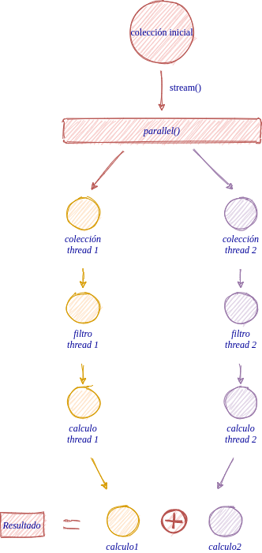

### Lambda Expresion
Se puede decir que una expresión lambda es una función anónima que se utiliza para implementar el método abstracto de una interfaz funcional:

### Características generales

* no tiene nombre
* no tiene modificadores
* no tiene tipo de retorno
* cuando se puede inferir el tipo de los parámetros, no es necesario incluirlo en la definición
* cuando la función anónima se define con una sola sentencia no son necesarias ni las llaves ni indicar el tipo de retorno mediante **return**
* pueden generar excepciones, pero tendrán que ser compatibles con las excepciones declaradas en la signatura del método abstracto que implementa.
* soportan el procesamiento paralelo de [streams](../streams/streams.md)
  Una expresión de este tipo sería como la siguiente:

```java
double total=lista.stream()
                .parallel()
                .filter(peso->(peso>200))
                .mapToDouble(peso->peso*2.5).sum();
```

Y su procesamiento algo similar a lo que se muestra en la imagen: 



### Sintaxis
Una expresión lamda implica un nuevo elemento sintáctico en Java, el operador "flecha (-->)", que divide una exresión lambda en dos partes, la parte de la izquierda especifica los parámetros necesarios para la expresión lambda, mientras que a su derecha se encuentra el cuerpo. De forma que una expresión lambda adoptaría la siguiente forma:

```java 
   (parámetros) --> { cuerpo de la función}
```

Sin embargo, esta formato general puede simplificarse en función de las características concretas de cada caso: 

Caso general, la función add 

```java
public int square(int a, intb){
    return a + b;
}
```

expresada en términos de lamda:

```java
(int a) -> {return a * a;}
```

Ahora bien, a esta expresión se le pueden aplicar una serie de reglas de simplificación de sintaxis de expresiones lambda:

1ª) Si el compilador puede inferir el tipo de los parámetros de entrada, no hace falta declarar su tipo. 

```java
(a) -> {return a * a;}
```

2ª) Si existe un único parámetro de entrada, se pueden eliminar los paréntesis de los parámetros.

```java
a -> {return a * a;}
```

3ª) Si se puede inferir el tipo de retorno del cuerpo del la función, se puede eliminar la palabra reservada return.

```java
a -> { a * a;}
```

4ª) Si se puede expresar el cuerpo de la función en una sola línea, se pueden eliminar las llaves del cuerpo de la función.

```java
a ->  a * a;
```

### Uso de expresiones lamda
El uso de expresiones lambda, sin duda, está ligado a las interfaces funcioanles. En concreto es la forma de implementar una interfaz funcional mediante un método anónimo.

Un ejemplo de la implementación tradicional de una interfaz funcional sería la siguiente:

```java
public interface FunctionalInterface{
    public void act();
}

public class FunctionalInterfaceImpl{
    public void act(){
        System.out.println("act implementation");
    }
}

public class test{
    public static void main (String[] args){
        FunctionalInterface fi= new FunctionalInterfaceImpl();
        fi.act();
    }
}
```

En contraposición, su implementación con una expresión lambda sería la siguiente:

```java
public interface FunctionalInterface{
    public void act();
}

public class test{
    public static void main (String[] args){
        FunctionalInterface fi= () -> System.out.println("lambda expresion impl for act() method");

        fi.act();
    }
}
```

[<< functional interface](../functionalInterface/functionalInterface.md)

[anonymous inner classes vs lambda expresions >>](anonymousInnerClassVSlambdaExpresions.md)

[índice](../../spring/S1/index.md)