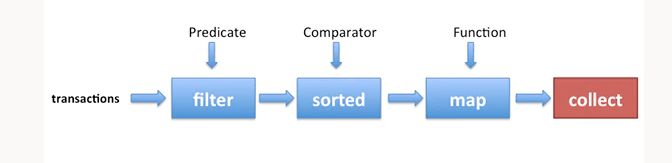
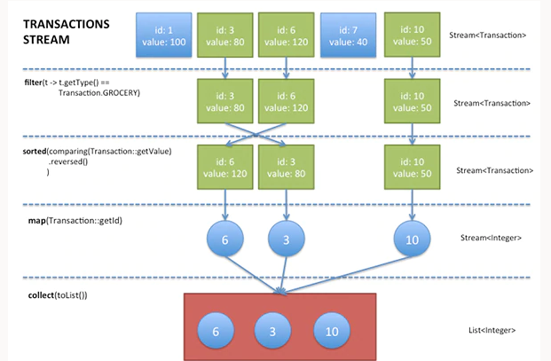

# Streams

La principal diferencia entre colecciones y streams, es que las primeras hacen referencia a datos y éstos hacen referencia a cómputos.

Un stream es una abstracción para procesar datos de forma declarativa. Permiten además aprovechar las arquitecturas multinúcleo sin necesidad de hacer programación multiproceso.

En términos más concretos, es una secuencia de elementos origen, que admiten una secuencia de operaciones concatenadas.

* Secuencia de elemntos. Stream proporciona una interfaz para conjuntos de vlares secuenciales de un tipo particular. Es importante entender que los streams no almacenan elementos, realizan cálculos sobre éstos.
  
* Origen. Los streams se alimentan de un origen de datos, como colecciones, matrices o recursos E/S

* Operaciones concatenadas. Los streams admiten la mayoría de las operaciones de los lenguajes funcionales como filter, map, reduce, find, match y sorted.

Pero además de éstas, las operaciones con streams tienen dos características:

* estructura de proceso. Muchas operaciones de de streams devuelven otro streams, de forma que permite la concatenación de operaciones. Y esta es la clave de obtner algunas optimizaciones como el procesamiento perezoso (laziness) y los cortocircuitos (short-circuiting). 

* Iteración interna. La iteración entre los elementos a los que se aplica la operacion es implícita.

Las principales operaciones que podemos utilizar con streams son:

* filter, para filtrar elmentos según un predicado
* sorted, para ordenar elementos según un comparador
* map, para extraer información




Un ejemplo concreto de concatenación de estas operaciones es el siguiente:



## Filtrado

Existen diferentes operaciones de filtrado:

* filter (Predicate): toma un predicado como argumento y devuelve otro stream con los elementos que lo cumplen

* distinct: elimina las repeticiones de elmentos, para devolver un nuevo stream con los ejemplares únicos.
  
```java
Collection<String> list = Arrays.asList("A", "B", "C", "D", "A", "B", "C");
// Get collection without duplicate i.e. distinct only
List<String> distinctElements = list.stream()
                        .distinct()
                        .collect(Collectors.toList());
//Let's verify distinct elements
System.out.println(distinctElements);
```

* limit(n): Devuelve un stream cuya máxima longitud es n
  
* skip(n): Devuelve un stream en el que se han descartado los primeros n números

## Búsquedas e identificación de coincidencias.

Este tipo de operaciones sobre streams toman como argumento un predicado y devuelven un valor booleano. Las principales operaciones son:

* forEach() -> no devuelve nada
* count ()
* sorted(). Admite dos signaturas, sin parámetros para los tipos que admiten una ordenación natural y con un Comparator.
* min(Comparator c)
* max(Comparator c)
* reversed()
* anyMatch(Predicate p)
* allMatch (Predicate p)
* noneMatch (Predicate p)

```java
boolean expensive =   
    transactions.stream()   
    .allMatch(t -> t.getValue() > 100);
```
Otras operaciones de búsqueda, que devuelven un optional son:

* findFirst
* findAny

```java
Optional<Transaction> =
    transactions.stream()    
    .filter(t -> t.getType() == Transaction.GROCERY) 
    .findAny();
```
La clase optional, es una clase contenedora que repressenta la existencia o ausencia de un valor.

## Recolección de resultados
 
 * toArray()
 * collect()

## operaciones map, de extracción de elementos

La operación de extracción es map, que recibe una función como parámtro y proyecta los elementos del stream en otro formato.

## operaciones Reduce

Son operaciones que se aplican sobre la combinación de todos los elementos del stream. Esta operacion aplica reiteradamente otra operación a cada elemento, hasta que se genera el resultado.

La operación reduce, admite dos parámetros, el primero es el valor inicial, y el segundo la función que se aplica

```java
int sum = numbers.stream().reduce(0, (a, b) -> a + b); //suma de todos los elementos

int product = numbers.stream().reduce(1, (a, b) -> a * b); //producto de ltodos los elementos

int product = numbers.stream().reduce(1, Integer::max); //elemento máximo.
```

Sin embargo las operaciones anteriores realizan muchas operaciones de boximg. Una aproximación más eficiente es la siguiente:

```java
int statement = 
  transactions.stream() 
  .map(Transaction::getValue)  
  .sum(); // error since Stream has no sum method

  int statementSum = 
  transactions.stream()
  .mapToInt(Transaction::getValue)   
  .sum(); // works!
```

## Creación de streams

Hay bastantes maneras de crear streams, la más habitual a partir de colecciones, pero también se puede crear a partir de valores, matrices o archivos, incluso a partir de una función para generar streams infinitos (sin reserva previa)

* list.stream()
* Arrays.stream(array)
* Streams.of(1,3,4)
* Files.lines(Path.get("file.txt"), Charset.defaultCharset) -> genera un stream de líneas
* Stream.iterate(0, n -> n + 10)
* Stream.generate(new Random()::nextInt)

[revisar este contenido](https://www.oracle.com/java/technologies/architect-streams-pt2.html)

[<< operador ::](./../operador::.md)

[>> date and time](./../dateTime.md)

[índice](./../index.md)