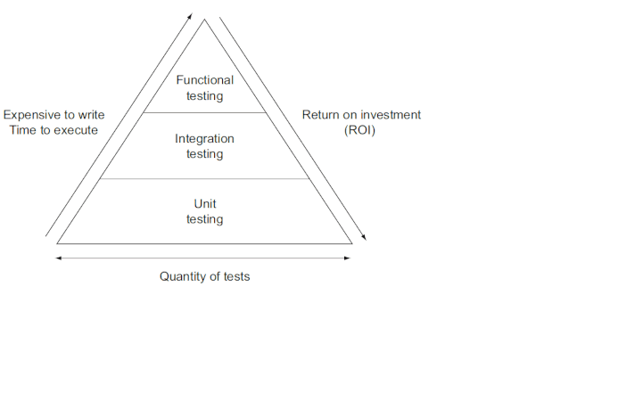

# Conceptos generales

## Por qué utilizarlo (ampliamente aceptado)

* mejora la calidad del software
* asegura que el código hace lo que debería
* evita los daños colaterales por corrección de incidencias
* permite cambiar el código existente con confianza

## Terminología

* **Code under test**: código que se está probando
* **Test Fixture**: objetos con un estado determinado utilizados como línea base para ejecutar nuestros test. La idea es tener un entorno fijo y estable que permita que los test se puedan ejecutar repetidamente obteniendo los mismos resultados
  * Esto inluye: datos de entrada, mock object, carga de BBDD de pruebas, etc.
* **Unit Test**:
  * Su cobertura ideal es del 70-80%, no hay que obsesionarse con cubrir más de ese porcentaje, ya que de lo contrario la eficiencia empieza a decrecer.
  * Su ejecución deber ser rápida
  * no debe tener ningún tipo de dependencia externa
* **Test de integración**
  * su ámbito es más amplio que el de los objetos
  * comprueban el comportamiento de los objetos en el conjunto del sistema
    * pueden utilizar BBDD, contexto, etc
    * son más lentos que los test unitarios
* **Test Funcionales**
    * se prueba el funcionamiento de la aplicación
    * la aplicación se despliega en un entorno diseñado para tal fin
    * prueba los puntos de interacción entre los consumidores y el dominio/negocio
    * son test de alto nivel

En general para una amplicación el rengo debería ir desde los cientos de test unitarios a las docenas de test funcionales, aunque no hay ninguna regla al respecto.

* Agile Testing Methods
  * TDD. La idea es empezar a codificar los test y a partir de ahí codificar la solución refactorizando
  * BDD. Es muy parecido al anterior, de hecho son casi intercambiables, éstos hacen mayor hincapié en la descripción funcional/comportamental del test, con secciones del tipo given/when/then
* Principales Frameworks de testing Java
  * **JUnit**. Es probablemente el más importante por su rápida adpción
  * **Test NG**. Lanzado en el 2004, trataba de solucionar algunas de las deficiencias de JUnit, pero la evolución de éste último fue muy superior, y aunque todavía se sigue utilizando en la industria, su uso es menor.
  * **Spock**. Escrito en Groovy, el inconveniente que tiene es que aunque está pensado para probar Java, tienes que saber algo de groovy para poder utilizarlo. Sin embargo y aunque JUnit ha evolucionado en los test orientados a MVC, Spock sigue presentando algunas ventajas.
  * **Cucumber**. Es un frameword para probar BBDD. Es muy popular porque su sintaxis permite definir el qué y no el cómo. 
  * **Mockito**. Es un framework que proporciona la forma de probar con mocks, pero necesitas un framework de test como JUnit o TestNg.
  * **REST-assured**. Framework para probar servicios RestFul.
  * **Selenium**. Automaticación de navegadores
  * **GEB**. Es un framework Groovy que ha creado un wrapper sobre Selenium. Permite lanzar contenedores docker desde JUnit, y arrancar BBDD, brokers, etc. Además se puede combinar con Selenium.
  * **Servidores de integración contínua**
    * On Premise: Jenkins, Bamboo, TeamCity, Hudson
    * Clound: CircleCI, TravisCI, CodeShip, GitLab CI, AWS codeBuild
  * **Continouos deployment**. Es el despliegue de los artefactos una vez ejecutadas con éxito las tareas de integración contínua.
  * **Continous delivery**. Se refiere al hecho de entregar el producto en el entorno de producción. Pero es un área relativamente inmadura, que está evolucionando y no hay estándares, solo unas cuantas reglas y buenas prácticas.
