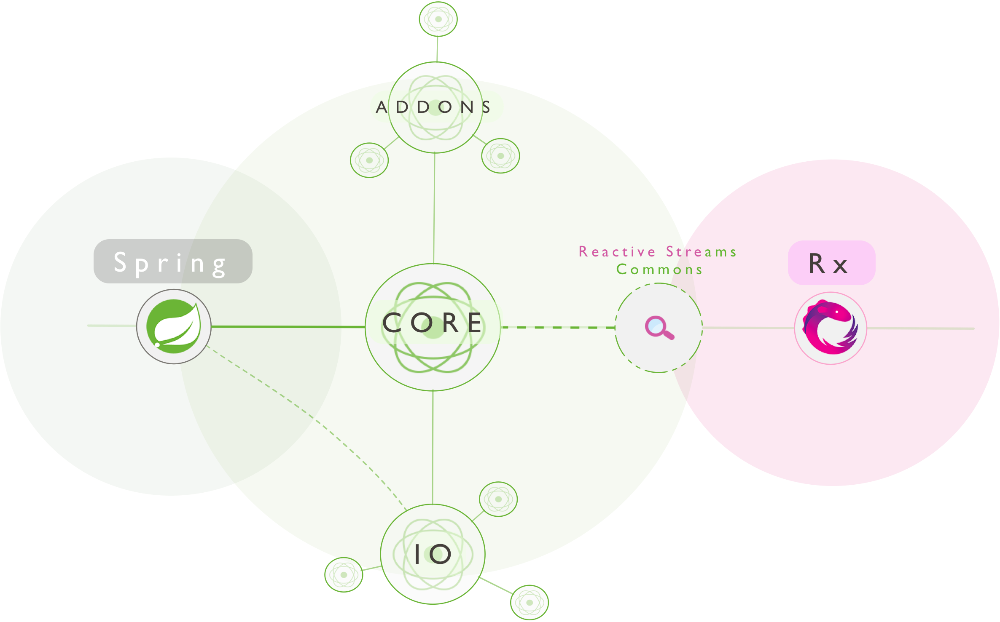

# WebFlux

WebFlux es un API que proporciona funcionalidad basada en [Reactive Streams](https://www.reactive-streams.org/) para ejecutarse en servidores no bloqueantes como Netty, Undertow y contenderos Servlet 3.1.

Reactive Stream juega un papel importante en la interoperabilidad, porque aunque menos importante como API de aplicación por su bajo nivel, sí tiene importancia para la construcción de componentes y librerías. Las aplicaciones necesitan librerías de alto nivel y más enriquecidas para poder componer lógica asíncrona, similar a los streams de Java8, **pero no solo para colecciones**

Otra "pata" es [Reactor Project](https://projectreactor.io/), cuya librería es en la que está basado Spring WebFlux. Reactor proporciona los tipos Mono y Flux para trabajar con secuencias a través de un conjunto de operadores alineados con el vocabulario de operadores [ReactiveX](http://reactivex.io/). Especalmente centrado en el server-side Java, está desarrollado en estrecha colaboración con Spring, y asegura non-blocking back pressure en todas sus operaciones.

Aunque el core de WebFlux es dependiente del proyecto Reactor, es interoperable con otras librerías de programación reactiva basadas en Reactive Streams. En el siguiente esquema, se puede ver el ecosistema:

Todo el subconjunto verde es el proyecto Reactor, que en sus límites se relaciona con Spring que lo utiliza, y por la derecha implementa la semántica de operaciones Rx gracias a Reactive Streams.

Sin embargo el Proyecto Reactor, tiene varios [subproyectos](https://projectreactor.io/docs), que se pueden aplicar a otras tecnologías, de colas, BBDD, etc..
