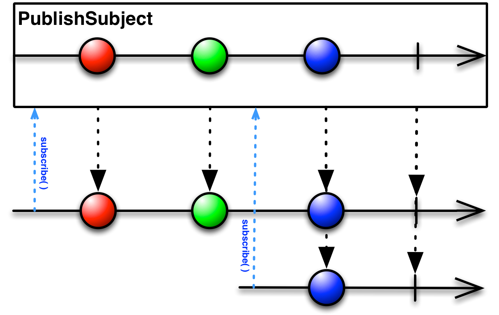

# Actores

Para hablar de los actores implicados en la programación reactiva, hay que remontarse al patron Observer [(GoF)](https://en.wikipedia.org/wiki/Observer_pattern). Se trata de un patrón de comportamiento, orientado a gestioanr las relaciones entre objetos.

Los principales actores en este patrón son el sujeto y el observador, que en la programación reactiva han evolucionado a publicador y suscriptor.

La idea es que el observer, somo indica su nombre, observa al sujeto, y quiere que éste le notifique determinados cambios en su estado:

Posteriormente, y con la idea abstraer la comunicación entre los actores, manteniéndolos ajenos a la estructura interna del otro, se introdujo otro patrón de comportamiento para modelar interacciones, Iterator  [(GoF)](https://es.wikipedia.org/wiki/Iterador_(patr%C3%B3n_de_dise%C3%B1o)). Con esta evolución, se evolucionó a un model del tipo:

Cuyo comportamiento sería algo similar a:

## Roles

### Sujetos

Sin embargo, los sitemas suelen ser más complejos, y se pueden adoptar diversos roles y comportamientos. Así se pueden encontrar sujetos que a su vez sean observadores, dando lugar a una tipología de sujetos:

* Async Subject: solo se envía el último valor de su ejecución a sus observadores, y solo cuando finaliza su ejecución. Un aspecto al que hay que prestar atención y que se observa en el siguiente diagrama, es que da igual en el momento en el que se suscriban sus observadores, todos recibirán el último evento.

* Behavior Subject. Éste, es un sujeto que a su vez observa otra fuente. Su comportamiento consistirá en:
  * emitiendo el evento más reciente observado en la fuente, a partir de la suscripción del observador.
  * si en el momento de la suscripción, en la fuente no se ha producido todavía ningún evento, emite uno por defecto al suscriptor, y continua emitiendo la secuencia de eventos que se den en la fuente.
  * Este comportamiento cambia en el caso de que se produzcan suscripciones después de que se produzca un error en la fuente, ya que los observadores recibirán el error emitido por la fuente.

* Publish subject. Este tipo de sujetos, emiten a sus observadores, los eventos que se han producido en la fuente. El riesgo de este planteamiento se encuentra en que los observadores no recibirán los eventos anteriores a su suscripción, y en caso de que éstos sean necesarios para reconstruir un estado, solo tendrán información parcial.

* Replay Subject. Emite a los observadores todos los eventos que se han producido en la fuente, independientemente de que éstos se hayan producido antes de su suscripción. Puede seguir diferentes políticas para la emisión de los eventos, temporales, tamaño de buffer, etc. En este diseño los observadores, deben tener cuidado con el uso de onNext(), ya que podrían recibir eventos duplicados

### Observables

En cuanto al origen de datos, los sujetos se clasifican en dos tipologías

* Cold observables. Los eventos se generan en su interior, y solo empiezan a emitir notificacioens, cuando existe algún suscriptor. En esta categoría podrían estar las BBDD o los servicios web.

Lo normal es que cada suscriber tenga su propia fuente de datos, de forma, que la información de los observables no es compartida.

* Hot observables. En este caso no hay control sobre el ratio de emision. El sujeto emite los eventos intependientemente del momento de la suscripción. El evento se produce en el exterior del observable. Ejemplos de este tipo pueden ser los periféricos, ratón, teclado, interfaces de usuario, etc.

