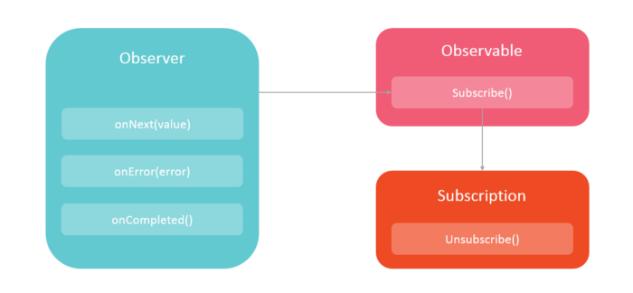

# Introducción

Es un paradigma de programación, centrada en la gestión de flujos de datos, y la propagación de cambios. Se pueden tratar tanto flujos de datos estáticos, como dinámicos.

El manifiesto "reactive" fue publicado en 2013, y los sistemas reactivos, implican un paradigma de arquitectura y de diseño en respuesta a su naturaleza cloud y demanda masiva que sufren.

Pero la programación reactiva implica otra granularidad. Se basa en técnicas de programación asíncrona no bloqueante centradas en la captura de eventos. Se basa en la concepción de que todo flujo puede ser observado por un observador (observer and observable philosophy).

Sin embargo no hay que confundirlo con la programción funcional reactiva, que es una cosa distinta, en la que se intentan combinar dos paradigmas de programación, la programación reactiva, y la programación funcional.

Dicho esto, el manifiesto reactivo se articula en torno a 4 conceptos:

* **responsivos**
  * el sistema debe responder a tiempo en la medida de lo posible, incrementando su usabilidad y utilidad.
  * la sensibilidad es su piedra angular, implica que los problemas deben ser detectados rápidamente para tratarlos de forma efectiva.
  * los sistemas responsivos proporcionan hunos tiempos de respuesta rápidos y consistentes
  * el comportamiento consistente simplifica la gestión de errores, genera confianza en el usuario final, y anima a seguir usando el sistema  
* **resilientes**
  * el sistema debe seguir respondiendo a pesar de la existencia de fallo
  * la resiliencia se logra mediante replicación, contención, aislamiento y delegación
    * delegación: el sistema entrega la responsabilidad del procesamiento a otro componente. De forma que el sistema original puede dedicarse a otra tarea u observar el progreso en del proceso delegado, para capturar errores o informar del progreso
  * los fallos se aislan en el interior de cada componente
  * las partes del sistema pueden fallar sin comprometer el sistema como conjunto
  * la recuperación del fallo de ## Programación reactiva ecosistema Java  

La programación reactiva es una nueva especificación en el API Java, denominada reactive streams, que aparece en la versión 9. Así pues en Java este paradigma implica el trabajo con flujos finitos o infinitos, de forma asíncrona. Trata de dar respuesta a las limitaciones de escalado debidas a desaprovechamiento de CPU por operaciones I/O, sobreuso de memoria por abuso de pools de threads, y las interacciones bloqueantes.

Ejemplo de arquitectura reactiva:

Teniendo en cuenta lo anterios, se puede decir que la programación reactiva debe asegurar:

* la ejecución asíncrona no bloqueante, mediante streams.
* contruir sistemas reactivos.
  * un stream es una secuencia de eventos ordenada en el tiempo
  * Son datos de cualquier tipo:
    * click de ratón
    * mensajes JMS
    * llamadaUn concepto relacionado esón de procesamiento asíncrono (abstrae el hecho de que el progrma se síncrono o asíncrono)
  * lo hace de forma asíncrona
    * los eventos se capturan de forma asíncrona
    * un tipo de funciones se definenen para ser ejecutadas frente a la emisión de eventos
    * otro tipo lo hacen si se produce un error
    * otros cuando se completa el procesamiento del evento.
    * lo importante aquí es la independencia funcional entre tipos de funciones
* es no bloqueante
  * se procesan datos disponibles y cuando no haya, se pide solicita notificación cuando hay más datos disponibles.
  
Dentro del ecosistema Java se pueden describrir cuatro etapas evolutivas en la funcionalidad aportada para la implementación de sistemas reactivos:

* el uso del patrón Observer/observable (Gof)
* incorporar la composición de operaciones al patrón anterior
* nuevas interfaces para aliviar el backpresure, Subscriber y Producer
* adopción de reactive streams:
  * Publisher
  * Suscriber
  * Subscription
  * Processor

El uso de Reactive Streams es similar al del patrón Iterator (incluyendo Java 8 Streams) con una clara diferencia, la inversión de control. El primero es push-based mientras que el segundo es pull-based:

|Evento|Iterable (push)|Reactive (pull)|
|------|---------------|---------------|
|Obtener dato|next()|onNext(Object data)|
|Error|throws Exception|onError(Exception)|
|Fin|!hasNext()|onComplete()|

Y el contexto construido sería similar al de la siguiente figura:

Adicionalemnte, las nuevas librerias rectivas, han tratado de mejorar los siguientes aspectos:

* composición y legibilidad.
  * La primera aproximación al concepto de flujos asíncronos, si el uso explícito de threads, eran los Future con sus callback o CompletableFuture. Sin embargo dificultaban la legibilidad, y la composición de operaciones.
* Backpressure. Las soluciones en este sentido, tratan de aliviar la carga cuando el publisher genera más datos de los que el suscriber puede consumir. Se han propuesto dos aproximaciones para solucionarlo:
  * el suscriber indica el número de datos a procesar (suscriber.request(n))
  * el publisher puede aplicar operaciones intermedias de buffers y filtrados para aliviar el suscriber

## Reactive Streams

Cómo se relaciona el API Reactive Streams con Spring y con el framework Spring 5.

* Su objetivo es crear un standar para streams asíncronos sin con una backpressure no bloqueante.
* Empezaron en 2013 con el trabajo de ingenieros de diversas empresas, y la primera versión se liberó en abril de 2015.
* Actualmente forma parte de Java 9.
* El API está definido por un conjunto de 4 API's:
  * Publisher
  * Suscriber
  * Subscription
  * Processor
  
Uno de los prblemas es que el API tradicional de Spring no es reactivo, es bloqueante. Por este motivio, se ha desarrollado un nuevo API reactivo, denominado Spring Webflux.

Esto no quiere decir que no se puedan utilizar los controladores tradicionales, pero en el escenario en el que nos encontremos con un entorno de un volumen elevado de streams, se debe utilizar webflux, el cual sigue soportando el contenedor de servlet tradicional, pero que además dispone de soluciones reactivas en Tomcat, Jetty, Netty o Undertown. De éstas, probablemente la más robusta sea Netty.
 
## Spring reactive types. Project Reactor

Spring Framework 5 ha introducido dos nuevos tipos de streams reactivos:

    * Mono: publisher con cero o un elemento de streams de datos

    * Flux: publiser con cero o muchos elementos en el stream de datos

Ambos implementan la interfaz Publisher.

componentes, es delegada a algún componente externo.
  * se asegura la alta disponibilidad por replicación.
  * el cliente de un componente no debe preocuparse de sus fallos.
* **elásticos**
  * el sistema responde ante variación de la carga de trabajo
  * el sistema puede variar los recursos que utiliza en función de la variación de la demanda. Utilizan algoritmos de escalado predictivos y reactivos, proporcionando indicadore de rendimiento en tiempo real.
  * no tienen puntos de contención ni cuellos de botella.
  * los sitemas reactivos logran la  eslasticidad de forma rentable a nivel de recursos software y hardware
* **orientado a mensajes** Es probablemente uno de los aspectos más importantes desde el punto de vista de los desarrolladores java.
  * los sistemas reactivos confían en la mensajería asíncrona como frontera entre componentes, porque proporciona bajo acoplamiento, aislamiento y transparencia de ubicación
    * transparencia de ubicación: el código que envía el mensaje, permanece estable con independencia de a dónde tenga que enviar el contenido. No se tiene que definir su topología o modelo de despliegue
  * la transparencia de ubicación permite delegar la gestión de fallos, como mensajes.
    * las excepciones no se lanzan en la forma tradicional
    * en su lugar se utilizar una función handler
  * la comunicación mediante mensajería asíncrona permite la gestión de carga, elasticidad y control de flujo
  * la comunicación no bloqueante permite que los destinatarios solo consuman recursos cuando estén activos, disminuyendo la sobrecarga de sistemas.

Teóricamente, si se cumplen los cuatro principios, nos encontraremos con un sistema:

_"... flexibles, con bajo acoplamiento y e. Programación reactiva - https://es.qaz.wiki/wiki/Reactive_programming y cuando fallan responden con elegancia y no con un desastre. Los Sistemas Reactivos son altamente responsivos, dando a los usuarios un feedback efectivo e interactivo. ..."_

 Los sitemas grandes, están compuestos de otros más pequeños, y por lo tanto dependen de las propiedades reactivas de sus partes, y por tanto deben aplicar principios de diseño para que las propiedades sean válidas a cualquier escala.

## Estrategias

 Existen fundamentalmente tres enfoques reactivos:

* Pull : El consumidor es proactivo, consulta regularmente la fuente observada en busca de valores y reacciona siempre que hay un valor relevante disponible. Esta práctica se conoce como sondeo
* Push : el consumidor recibe un valor de la fuente siempre que el valor está disponible.
* Push-pull : el consumidor recibe una notificación de cambio, una breve descripción del cambio, esta es la parte de push. Sin embargo, la notificación no contiene toda la información necesaria, por lo que el consumidor debe consultar la fuente para obtener el valor específico, esta es la parte de extracción. Este método se usa comúnmente cuando hay un gran volumen de datos en los que los consumidores podrían estar potencialmente interesados. Por lo tanto, para reducir el rendimiento y la latencia, solo se envían notificaciones ligeras; y luego aquellos consumidores que requieran más información solicitarán esa información específica. Este enfoque también tiene el inconveniente de que la fuente puede verse abrumada por muchas solicitudes de información adicional después de que se envía una notificación.

## Riesgos

Sin embargo, este paradigma implica una serie de riesgos que hay que vigilar cuando se diseña y se implementa un sistema:

* fallos: Hay expresiones que pueden ser dependientes de la ordenación topológica. Es decir, cuando el resultado de una operación depende de pasos intermedios, y éstos a su vez están distribuidos por el subistema, es posible que los pasos no se den en el orden deseado, y la expresión resultante arroje un resultado diferente al real.
* dependencias cíclicas: el gráfico de las dependencias debe ser un grafo dirigido acíclico (DAG). Este es un requisito de los sistemas reactivos, para permitir que la actualización reactiva termine. Para ello se suele imponer un delay que asegure que la evaluación actual termine antes de iniciar la siguiente
* Interacciones con el estado mutable: Los sistemas reactivos suelen asumir que sus expresiones son puramente funcionales. Así, puede elegir  diferentes órdenes en los que realizar las operaciones sin especificar su orden, para permitir optimizaciones. Sin embargo, cuando la implementación depende de un lenguaje de programación con estado, es posible que los programadores realicen operaciones mutables.
* backpressure: (Resistencia o fuerza que se opone al flujo de datos deseado a través del software). Quizás la forma más fácil de entenderlo sea desde la velocidad de cómputo, algunos de los ejemplos:

* transformación de datos de entrada en salida
* lectura y escritura de ficheros.
* comunicación entre servidores
* presentación UI
  
Se refiere a la capacidad que tiene el suscriber de solicitar la cantidad exacta de información que puede procesar. (la analogía es bueno.. es como si tienes sed y tienes que beber de una mangera de bomberos. No tiene sentido, tienes que decidir la cantidad de agua que quieres beber)
