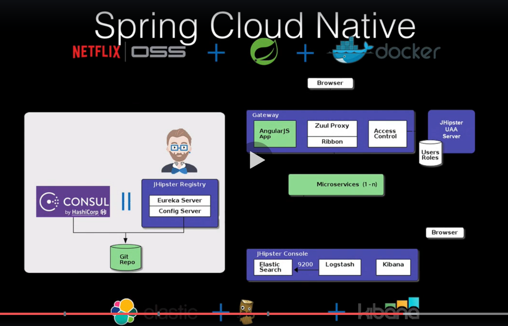
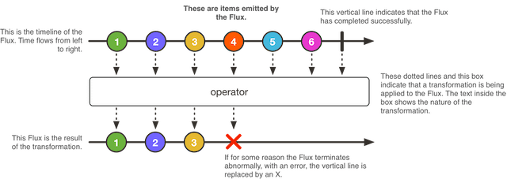

# Programación reactiva ecosistema Java  

La programación reactiva es una nueva especificación en el API Java, denominada reactive streams, que aparece en la versión 9. Así pues en Java este paradigma implica el trabajo con flujos finitos o infinitos, de forma asíncrona. Trata de dar respuesta a las limitaciones de escalado debidas a desaprovechamiento de CPU por operaciones I/O, sobreuso de memoria por abuso de pools de threads, y las interacciones bloqueantes.

Ejemplo de arquitectura reactiva:

Teniendo en cuenta lo anterios, se puede decir que la programación reactiva debe asegurar:

* la ejecución asíncrona no bloqueante, mediante streams.
* contruir sistemas reactivos.
  * un stream es una secuencia de eventos ordenada en el tiempo
  * Son datos de cualquier tipo:
    * click de ratón
    * mensajes JMS
    * llamadaUn concepto relacionado esón de procesamiento asíncrono (abstrae el hecho de que el progrma se síncrono o asíncrono)
  * lo hace de forma asíncrona
    * los eventos se capturan de forma asíncrona
    * un tipo de funciones se definenen para ser ejecutadas frente a la emisión de eventos
    * otro tipo lo hacen si se produce un error
    * otros cuando se completa el procesamiento del evento.
    * lo importante aquí es la independencia funcional entre tipos de funciones
* es no bloqueante
  * se procesan datos disponibles y cuando no haya, se pide solicita notificación cuando hay más datos disponibles.
  
Dentro del ecosistema Java se pueden describrir cuatro etapas evolutivas en la funcionalidad aportada para la implementación de sistemas reactivos:

* el uso del patrón Observer/observable (Gof)
* incorporar la composición de operaciones al patrón anterior
* nuevas interfaces para aliviar el backpresure, Subscriber y Producer
* adopción de reactive streams:
  * Publisher
  * Suscriber
  * Subscription
  * Processor

El uso de Reactive Streams es similar al del patrón Iterator (incluyendo Java 8 Streams) con una clara diferencia, la inversión de control. El primero es push-based mientras que el segundo es pull-based:

|Evento|Iterable (push)|Reactive (pull)|
|------|---------------|---------------|
|Obtener dato|next()|onNext(Object data)|
|Error|throws Exception|onError(Exception)|
|Fin|!hasNext()|onComplete()|

Y el contexto construido sería similar al de la siguiente figura:

Adicionalemnte, las nuevas librerias rectivas, han tratado de mejorar los siguientes aspectos:

* composición y legibilidad.
  * La primera aproximación al concepto de flujos asíncronos, si el uso explícito de threads, eran los Future con sus callback o CompletableFuture. Sin embargo dificultaban la legibilidad, y la composición de operaciones.
* Backpressure. Las soluciones en este sentido, tratan de aliviar la carga cuando el publisher genera más datos de los que el suscriber puede consumir. Se han propuesto dos aproximaciones para solucionarlo:
  * el suscriber indica el número de datos a procesar (suscriber.request(n))
  * el publisher puede aplicar operaciones intermedias de buffers y filtrados para aliviar el suscriber

## Reactive Streams

Cómo se relaciona el API Reactive Streams con Spring y con el framework Spring 5.

* Su objetivo es crear un standar para streams asíncronos sin con una backpressure no bloqueante.
* Empezaron en 2013 con el trabajo de ingenieros de diversas empresas, y la primera versión se liberó en abril de 2015.
* Actualmente forma parte de Java 9.
* El API está definido por un conjunto de 4 API's:
  * Publisher
  * Suscriber
  * Subscription
  * Processor
  
Uno de los prblemas es que el API tradicional de Spring no es reactivo, es bloqueante. Por este motivio, se ha desarrollado un nuevo API reactivo, denominado Spring Webflux.

Esto no quiere decir que no se puedan utilizar los controladores tradicionales, pero en el escenario en el que nos encontremos con un entorno de un volumen elevado de streams, se debe utilizar webflux, el cual sigue soportando el contenedor de servlet tradicional, pero que además dispone de soluciones reactivas en Tomcat, Jetty, Netty o Undertown. De éstas, probablemente la más robusta sea Netty.
 
## Spring reactive types. Project Reactor

Spring Framework 5 ha introducido dos nuevos tipos de streams reactivos:

    * Mono: publisher con cero o un elemento de streams de datos

    * Flux: publiser con cero o muchos elementos en el stream de datos

Ambos implementan la interfaz Publisher.

