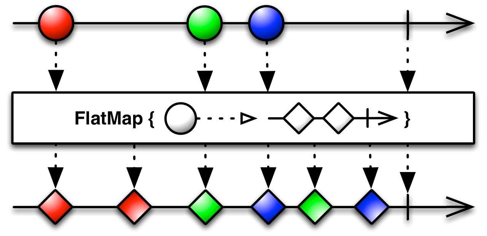
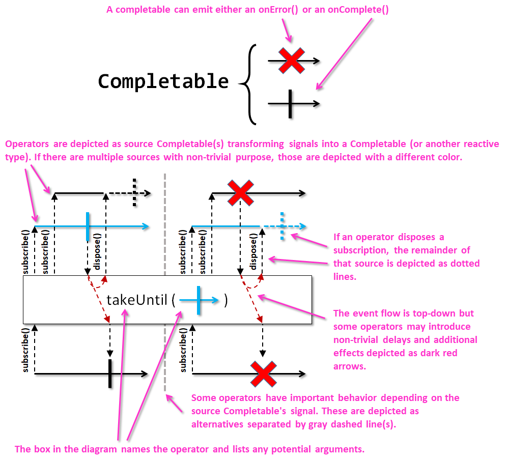

# Notación

La representación de operaciones reactivas, suele tener su propia notación. entre sus elementos encontramos:

1. La línea de tiempo

Su principal implicación es el sentido de la línea, los diagramas se leen de izquierda a derecha.

2.Símbolos de finalización de línea temporal y eventos:

En la línea temporal, además se pueden representar eventos y tipos de finalización:
* eventos y finalización correcta
  

* eventos y finalización con error

* eventos sin finalización

3.Operaciones. Las operaciones, son representadas mediante una caja rectangular bajo la línea de tiempo y los eventos. Por ejemplo FlatMap:

4.Eventos de respuesta. Se representan con la misma notación que los eventos de entrada, pero por debajo de la opración. El digrama completo sería:

5.Arrays. Aunque no se trate de un stream, este tipo de notación también guarda una representación para los arrays. Un conjunto de items entre corchetes.

Pero estos diagramas se pueden complicar en extremo con símbolos adicionales, como se explica en el siguiente diagrama, para completeable:

