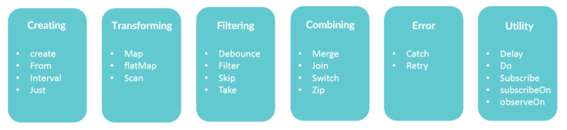

# Operaciones

Los tipos de operaciones que se pueden realizar en programación reactiva en el mundo java, en general vienen marcados por [ReactiveX](http://reactivex.io/), una plataforma multilenguaje que proporciona operaciones con streams reactivos. 

1. Creación de observables
    * Create
    * Defer
    * Empty/Never/Throw
    * From
    * Interval
    * Just
    * Range
    * Repeat
    * Start
    * Timer

2. Transformación de observables
    * Buffer
    * FlatMap
    * GroupBy
    * Map
    * Scan
    * Window

3. Filtrado de observables
    * Debounce
    * Distinct
    * ElementAt
    * Filter
    * First
    * IgnoreElements
    * Last
    * Sample
    * Skip
    * SkipLast
    * Take
    * TakeLast

4. Combinación de observables
    * And/Then/When
    * CombineLatest
    * Join
    * Merge
    * StartWith
    * Switch
    * Zip
  
5. Gestión de errores
    * Catch
    * Retry
  
6. Utilidades
    Delay
    Do
    ObserveOn
    Serialize
    Subscribe
    SubscribeOn
    TimeInterval
    Timeout
    Timestamp
    Using

Ademásde estas categorías que son las principales, exite alguna otra como Backpressure, Connectable, Mathematical y Conditional.