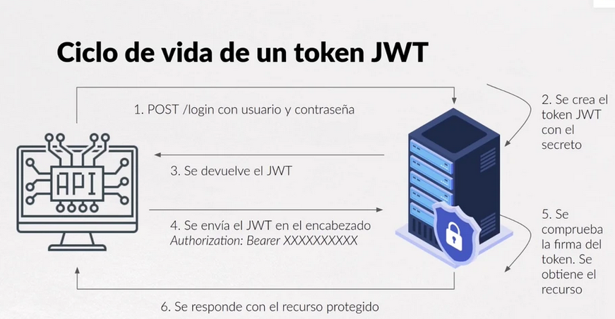

# JSON Web Token (JWT)

Se trata de un estándar abierto definido para el intercambio seguro de datos entre dos partes. 

Tiene la información necesaria para identificar una entidad, de forma que no es necesario consultar su información en BBDD ni guardarla en el servidor. Es una comunicación de sesión sin estado.

Es posible cifrar mensajes cortos, dotarlos de información sobre el remitente e indicar si éste cuenta con los derechos de acceso requeridos. Los usuarios no entran en acceso con el token, lo hacen de manera indirecta al introducir sus credenciales.

## Estructura

Un JWT firmado, consta de 3 partes codificadas de forma independiente en Base64: HEADER.PAYLOAD.SIGNATURE

Así que se puede ver el contenido del token sin necesidad de saber la clave con la cual se ha generado, aunque no podremos validarlo sin la misma.

La firma permite que si alguien modifica el token por el camino, inyectando alguna credencial o algún dato malicioso, entonces se podría verificar que la comprobación de la firma no es correcta.

El ciclo de acciones sería el siguiente:



### Header

Proporciona información sobre el tipo de token y el algoritmo de firma, así que está compuesta por dos valores:

* "alg"
* "typ"

```json
{
  "alg": "HS256",
  "typ": "JWT" 
}
```

Es recomendable qwue el tipo sea JWT ya que equivale a application/jwt, y en cuanto a los métodos de cifrado los más habituales:

* HS256
* RSA
* SHA-256
* ECDSA

No se recomienda prescindir de cifrado, aunque se puede indicar none si no se necesita un nivel de protección alto.

También se puede añadir un parámetro adicional **_"cty"_** para el content-type, si el token va firmado o cifrado.

### Payload

Es el cuerpo de la información que se transmitirá a la aplicación. Existen algunos conceptos específicos para su codificación:

* La información se proporciona en pares clave-valor, en los que a la clave se la denomina **_"claim"_**, y pueden utilizarse para definir los privilegios del usuario.
* Todos los claims son opcionales
* Un payload puede contenter un número ilimitado de claims (aunque es conveniente utilar la información del JWT al mínimo)

A su vez, los claims pueden clasificarse como:

* Registrados. Ideados para establecer un estándar son los que se definen en el [IANA JSON Web Token Claim Register](https://www.iana.org/assignments/jwt/jwt.xhtml), tales como dominio, destino, etc
* Públicos. Pensados para definirse a voluntad, así que no están sujetos a restricciones. Sin embargo si es necesrio resitrarlos en la misma IANA, o asignarles nombres que no puedan coincidir.
* Privados. Destinados a definir los datos que intercambiamos con nuestras propias aplicaciones. Aunque algunos de los conceptos que se pueden intercambiar ya existen definidos como claims públicos, utilizar claims privados nos permite utilizarlos de forma más concreta. **_Hay que prestar atención al definirlos para que no coincidan con ninguno resgistrado o público_**


### Signature

Se crea utilizando la codificación Base64 del header y el payload, y el método de cifrado especificado. Su estructura se define según el JWS (JSON Web Signature)

La firma depende de una clave secreta de la aplicación servidora. Así la firma verifica que el mensaje no ha sido modificado en ningún elemento intermedio, así como que el remitente dle JWT sea el correcto.

Dependiendo de la confidencialidad de datos, existen 3 tipos de firma:

* Sin protección:
    * El JWT solo constará de header y payload. 
    * El payload puede leerse como texto una vez decodificado en Base64. 
    * No se comprueba si el mensaje procede del remitente correcto 
    * No puede asegurarse que sufriese modificaciones en la transmisión
* Firma JWS. 
    * Asegura que el mensaje no se ha cambiado por el camino y que procede del remitente correcto.
    * El payload también puede leerse en clar una vez decodificdo en Base64
* Firma JWS y cifrado JWE (JSON Web Encryption). 
    * JWE cifra el contenido del payload
    * Se firma adicionalmente con JWS

## Cómo funciona

Lo primero que se necesita, es establecer una clave secreta a partir de la cual se securiza el token. 

A continuación, el usuario debe introducir sus credenciales, y se crea el JWT con la clave y se guarda localmente. Por este motivo, la vida del JWT debe ser la mínima necesaria que permita al usuario realizar sus acciones, pero que evite que sus credenciales estén _vivas_ por mucho tiempo.

La transmisión debe realizarse por medio de HTTPS para que los datos estén mejor protegidos. Cada vez que el usuario quiera acceder alos recursos como un API o una ruta protegida, el _user agent_ utiliza el JWT como parámetro o en el header de autorización. La otra parte puede descifrar el JSON Web Token y ejecutar la solicitud si la verificación se realiza correctamente.

## En qué casos está indicado

* Aplicaciones Rest porque garantiza la ausencia de envío de datos de autenticación
* CORS. JWT utiliza CORS, lo cual es una ventaja frente a las cookies
* Cuando se utilizan múltiples frameworks.


## Referencias

* [digital Guide IONOS](https://www.ionos.es/digitalguide/paginas-web/desarrollo-web/json-web-token-jwt/)
* [OpenWebinars](https://openwebinars.net/blog/que-es-json-web-token-y-como-funciona/)