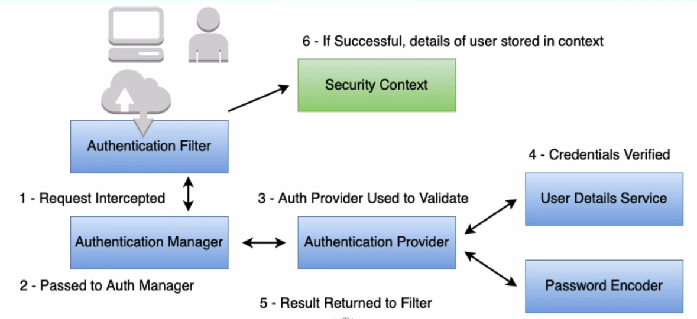

# In Memory Authentication

Son varios los elementos que intervienen en el proceso de autenticación de spring security. Son los que se muestran en el siguiente diagrama:



* Authenticatin Filter. Existen diferentes tipos posibles de autenticación en Spring Security (basic auth, remember me cookie, etc), y para cada uno de ellos exite un filtro
* Authentication Manager. Es un interface API utilizada por el filtro
* Authentication Provider. La implementación del mecanismo de autenticación (in memory, database, etc)
* User Detail Service. Proporciona información del usuario
* Password Encoder. Encripta y verifica passwords
* Security context. Almacena la información de la entidad de autenticación.

## Authentication Manager - In Memory Authenticación

Es la configuració por defectro de Spring Security, y tiene las siguientes características:

* Implementar User Detail Service
* La utiliza Spring Boot Auto-Configuration
* Se basa en un in-memory map, así que no utilza persistencia
* Si finalidad principal es ser de utilidad en test y para pruebas de concepto. **No suele utilizarse en sistemas productivos**

### User Detail Service

El UserDetailService se puede sobrescribir en la clase que se esté utilizando para configurar Spring Security, un ejemplo podría ser:

```Java
    @Override
    @Bean
    protected UserDetailsService userDetailsService() {
        UserDetails admin= User.withDefaultPasswordEncoder()
                .username("spring").password("guru").roles("ADMIN").build();

        UserDetails user= User.withDefaultPasswordEncoder()
                .username("user").password("password").roles("USER").build();

        return new InMemoryUserDetailsManager(admin, user);
    }
```

Se trata solo de un ejemplo, ya que el método withDefaultPasswordEncoder, al ser la configuración por defecto de Spring, tiene inconvenientes de seguridad.

Al proporcionar las credenciales de usuario mediante UserDetails, dejan de ser necesarias las propiedades definidas en el fichero de propiesdades Spring, que se definieron en la configuración incial:

```yml
spring.security.user.name=nombreUsuario
spring.security.user.password=passwordUsuario
```

### User Detail Service con Fluent API

Se trata de otra forma de definir el UserDetail, igual que en la secicón anterior pero de una forma algo más elegante, al escribirse de forma más compacta

```java
    @Override
    protected void configure(AuthenticationManagerBuilder auth) throws Exception {
        auth.inMemoryAuthentication().withUser("spring").password("guru").roles("ADMIN")
                .and()
                .withUser("user").password("password").roles("USER");
    }

```

Además no se define ningún bean adicional, ya que se sobrescribe uno de los métodos de WebSecurityConfigurerAdapter, de la que hereda la clase de configuración.

Sin embargo, esta configuración provocará un error indicando que no se ha definido ningún encoder para las password, ya que Fluent API, por defecto espera que sea así. Para evitar este error, si no se quiere definir ninguno, hay que indicarlo mediante {noop}

```java
    @Override
    protected void configure(AuthenticationManagerBuilder auth) throws Exception {
        auth.inMemoryAuthentication().withUser("spring").password("{noop}guru").roles("ADMIN")
                .and()
                .withUser("user").password("{noop}password").roles("USER");
    }

```

Por supuesto se trata de una mala praxis, porque la password, por seguridad, se debe guardar encriptada, pero esa es la forma de indicarlo.