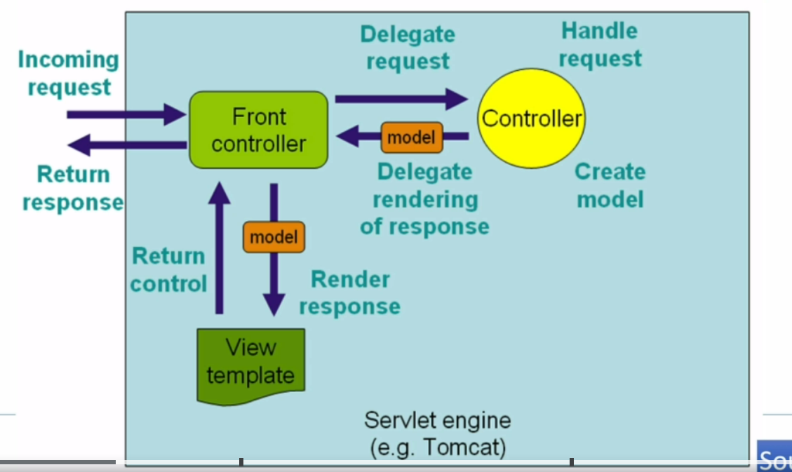
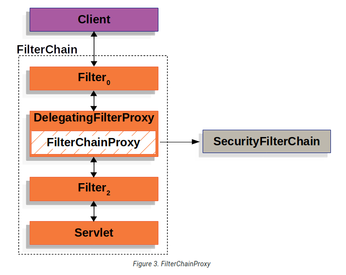
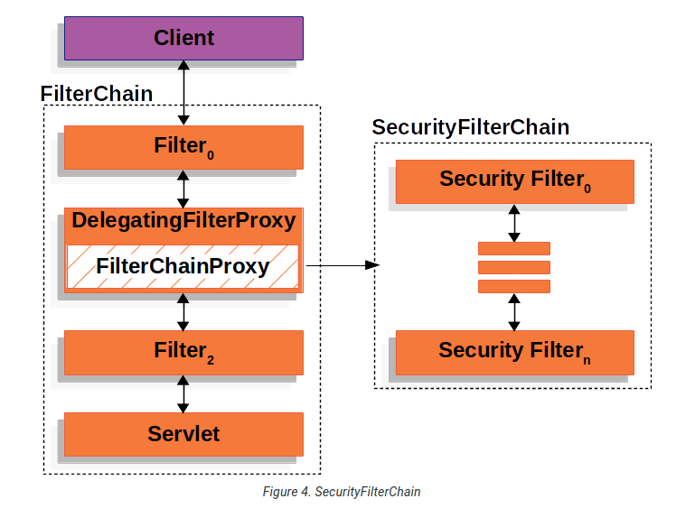
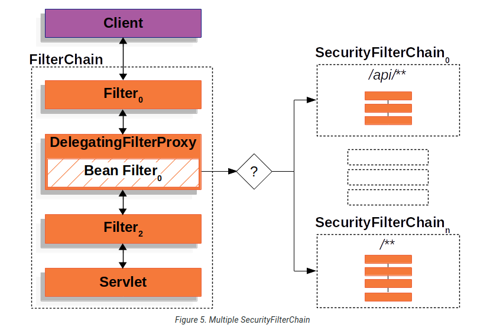

# Filter Chain

La secuencia básica en Spring MVC, es la que se puede ver en el esquema de la imagen:



Por otro lado, Spring Security lo que hace es aprovechar la  arquitectura de servlets y filtros Java, que se muestra en el siguiente esquema:



para añadir su propia capa de filtros, dando lugar al flujo siguiente:



Lo que se observa es que Spring proporciona un "Delegating Filter Proxy" que sirve para aplicar cadena de filtros (filter chain) por configuración, una de las cuales es la de seguridad. Pero se pueden aplicar otras cadenas antes o después, a la request o a la resposne.

Otra capacidad que proporciona es la de aplicar múltiples cadenas de filtros por path:



La lista completa de filtros y el orden en el que se aplican, se puede consultar en la documentación Spring, [Security Filters](https://docs.spring.io/spring-security/reference/servlet/architecture.html#servlet-security-filters)

Por lo general estros filtros proporcionados por Spring son transparente al desarrollo y no es necesario modificarlos.

## Configuración de filtros

Para poder empezar a trabajar con los filtros, una vez añadida la dependencia Spring-Security al maven, lo que hay que hacer es declarar una clase de configuración que active la configuración Spring. Esto se consigue mediante @EnableWebSecurity

```java
@Configuration
@EnableWebSecurity
public class SecurityConfig {
}
```