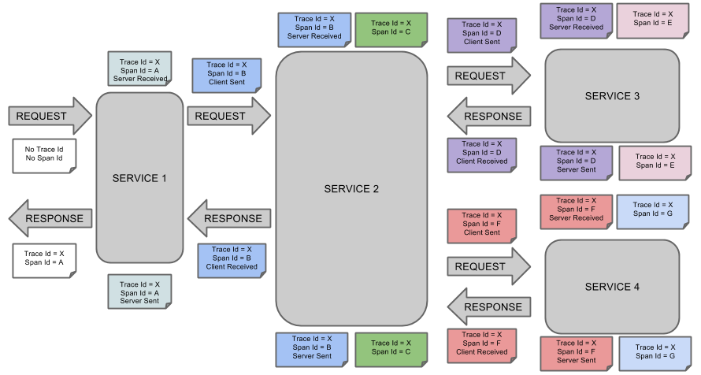
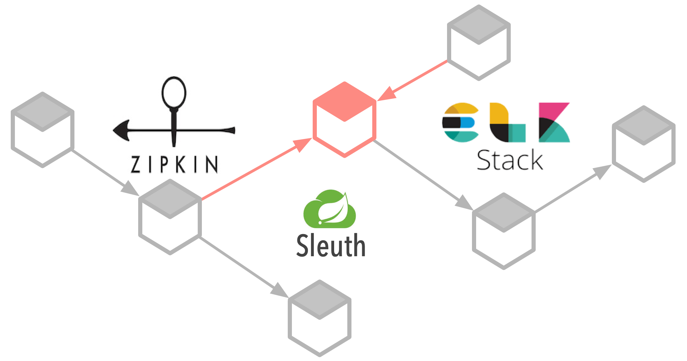

# Sleuth

## Contexto

Sleuth es una librería que permite identificar las peticiones de forma unívoca en una arquitectura SOA o de microservicios. Lo consigue asignando a cada petición:

* Trace. Identificador asociado a la petición que viaja entre microservicios
* Span. Identificador de la petición actual en el interior de un determinado microservicio

Es decir un Trace tiene asociado un conjunto de spans.

El objetivo es poder dotar de un mecanismo de trazabilidad que permita seguir una petición desde su recepción a través de todos los micro servicios de la arquitectura, con fines de auditoría, rendimiento y mantenimiento.

Cuando un microservicio se comunica con otro envía en su petición el Trace de la transacción global y el Span de su transacción. Si un microservicio no recibe estos identificadores los genera. 

En el protocolo HTTP estos identificadores se envían y reciben a través de las cabeceras, permitiendo correlacionar todas las trazas que emiten los diferentes microservicios de una misma petición. Así, haciendo una búsqueda por el identificador global, se obtiene el conjunto de trazas que han emitido los microservicios por las que ha transitado una petición.

Sleuth se encarga de propagar las cabeceras del servicio cliente al servicio servidor automáticamente instrumentando los clientes HTTP de RestTemplate, AsyncRestTemplate, WebClient, Apache HttpClient y Netty HttpClient



## Integración

### Sleuth

Para la integración se ha partido de un proyecto Initializr con las principales librerías comunes al resto de proyectos, y se ha observado lo siguiente:

#### maven

* Las versiones de Spring-boot no coinciden. La de SVA es la 2.3.2.RELEASE y la de Initializr la 2.4.4. He probado a bajarla y no funciona
* he añadido al pom (y funciona) los bloques de:
    * build
    * distributionManagement
    
* Con las librerías loycus y nuestra declaración de trazas, no funciona
    
* dependencias que funcionan:

```XML
      <dependency>
      	<groupId>com.loycuspay</groupId>
      	<artifactId>psd2.sign</artifactId>
      	<version>0.0.1-SNAPSHOT</version>
      </dependency>
      <dependency>
      	<groupId>com.loycuspay</groupId>
      	<artifactId>psd2.utilities</artifactId>
      	<version>0.0.1-SNAPSHOT</version>
      </dependency>
      <dependency>
      	<groupId>com.loycuspay</groupId>
      	<artifactId>psd2.security</artifactId>
      	<version>0.0.1-SNAPSHOT</version>
      </dependency>
      <dependency>
      	<groupId>org.flywaydb</groupId>
      	<artifactId>flyway-core</artifactId>
      </dependency>
      <dependency>
      <groupId>io.micrometer</groupId>
      <artifactId>micrometer-registry-prometheus</artifactId>
      </dependency>
      <dependency>
      <groupId>org.springdoc</groupId>
      <artifactId>springdoc-openapi-ui</artifactId>
      <version>1.3.9</version>
      </dependency>
              <!-- Micormeter core dependecy  -->
      <dependency>
      <groupId>io.micrometer</groupId>
      <artifactId>micrometer-core</artifactId>
      </dependency>
```  
  
* dependencias declaradas de forma distinta
  * lombok

#### logback

* La versión de Spring debe ser al menos la 2.4.4
* Spring configura su propio appender para logback, que va cambiando entre versiones. Por eso, muchos de los proyectos de ejemplo que hay por internet, al descargarlos no funcionan bien.
* Para saber la configuración de appender que se está utilizando, hay que:
  *  ver la clase **_DefaultLogbackConfiguration_** de la versión de spring que se esté utilizando.
  *  el valor de la propiedad CONSOLE_LOG_PATTERN
  *  con qué valor se guarda en setSystemProperty
  *  añadirlo en una clase para ver el contenido real del appender (en este punto se han sustituido todas las variables de la definición)
  *  importar la definición del appender a la definición específica de nuestro logback.

### zipkin

La imagen de zipkins se puede descargar directamente con docker:

```dockerfile
docker run -d -p 9411:9411 openzipkin/zipkin
```

## Zipkin

Zipkin es un sistema de rastreo distribuido que recolecta las transacciones creadas por Sleuth en la ejecución de los microservicios e información de los tiempos de respuesta de las invocaciones que han intervenido en una transación. Así que su mayor aplicación es la de ayudar a solucionar problemas de latencia.

Ofrece las dos funcionalidades la recolección de datos y la obtención de los mismos. Tanto la recolección como el almacenamiento ofrecen diferentes herramientas para implementarlo, la recolección puede ser mediante peticiones HTTP, RabbitMQ o Kafka y el almacenamiento en memoria, MySQL, Cassandra o Elasticsearch.



Su interfaz de usuario proporciona funciones de análisis instantáneo.

## Integración con Elasticsearch

Tanto zipkin como logstash, ofrecen plugins mediante los cuales se puede enviar información de rastreo a elasticsearch. Si los dos mecanismos fuesen incompatibles con Google Cloud, se puede seguir con la estrategia de escribir a la cola pub/sub el contenido, directamente en formato json.

## Referencias

* [hystrix y sleuth](https://picodotdev.github.io/blog-bitix/2019/04/trazabilidad-en-microservicios-con-spring-cloud-sleuth/)
* [esquema funcionamiento](https://medium.com/@yogonza524/traza-de-datos-con-spring-cloud-sleuth-b029555cbc7)
