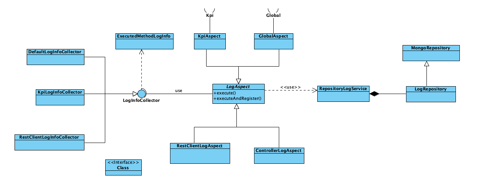
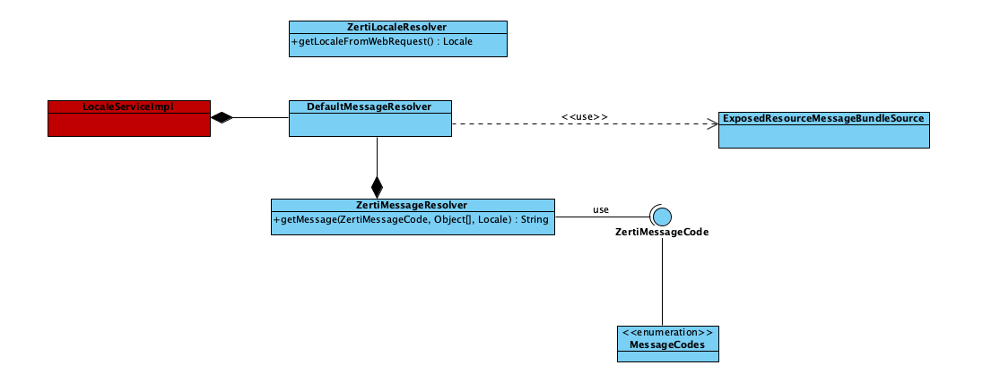
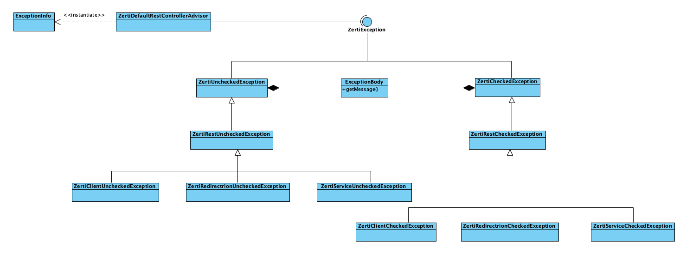

# loycuspay-utilities-service

Repositorio cuyo contenido se empaqueta en el artefacto **_psd2.utilities_**. Se trata pues de una dependencia que debe ser añadida en el fichero pom.xml de los servicios que quieran utilizarla.

Sus principales funcionalidades son:

## 1. Log

Para el tratamiento de log, utilities proporciona un API basa en aspectos, tanto a nivel de path como de anotaciones. Para la integración de esta utilidad hay que importar la clase de configuración de utilities en al microservicio incluyendo la anotación@Import({UtilitiesConfiguration.class}) en la clase la anotada con @SpringBootApplication.

### 1.1 Aspectos

#### 1.1.1 Anotaciones

Se han definido dos tipos de anotaciones para la gestión de log:

* @Global. Se anota a nivel de clase. Está pensado para escribir en log las invocaciones que se realizan en las clases más relevantes del microservicio. Dejará trazas sobre los parámetros de entrada y salida de todos los métodos públicos de la clase anotada.
* @Kpi. Se anota a nivel de método. Está pensado para la explotación de datos de negocio. Cuenta con varios parámetros para enriquecer la información de entrada y salida del método:
  * domain. Dominio Zertiban, Zertiren, etc
  * service. Microservicio en el que se produce la llamada
  * flow. Flujo de negocio en el que nos encontramos
  * step. Paso del flujo.
  * dependency. Dependencia

#### 1.1.2 Paquetes/ubicación

Los aspectos que se han definido de esta forma son:

* Invocación de controllers y servicios rest mediante los join point:
  * com.loycuspay.psd2.*.rest.*.*(..)
  * com.loycuspay.psd2.*.controller.*.*(..)
* captura de excepciones en controllers advisors
  * com.loycuspay.psd2.*.exception.*.*(..)
* Invocaciones al cliente rest de utilities, mediante el join point:
  * com.zerti.utilities.rest.client.RestClientImpl.call.

En el caso de este último aspecto, además de la escritura en log, también se escribe la misma traza a MongoDB.

Todos los aspectos comparte la misma estructura de información al escribir en log, se encuentra definida en ExecutedMethodLogInfo:

* className;
* methodName;
* input;
* output;
* timeTookInMilliseconds;
* status;
* timestamp;
* exceptionAspectInfo;
* kPIValues;

#### 1.1.3 Integración Aspectos

Para la utilización de los aspectos, además de incluir la dependecia utilities, y su clase de configuración, es necesario:

* Anotaciones: simplemente anotar las clases o métodos con las anotaciones @Global o @Kpi
* Paquetes: los microservicios que quieran utilizarlos, tendrán que definir una estructura de directorios que respete la definición del aspecto.

#### 1.1.4 Estructura

## 2. Mensajes

Esta utilidad está orientada a la gestión multi idioma de los mensajes de la aplicación. Trata de abstaer lo máximo posible la utilización de mensajes proporcionando un único punto de entrada a la recuperación de éstos, a través de la clase ZertiMessageResolver.

Utilities define sus propios mensajes, y algunos que pueden ser de uso genérico, pero los microservicios que quieran incluir sus propios mensajes, tendrán que definirlos en los ficheros "message.properties" para cada idioma. Además tendrán que definir una clase LocaleServiceImpl como se indica en la sección de integración, para cargarlos.

### 2.1 Estructura

### 2.2 Integración

* Eliminar la interfaz LocaleService del microservicio
* Modificar LocaleValidatorConfig. Crear un método globalMessageSource que devuelva un @Bean con el nombre que se utilice desde LocaleServiceImpl para inyectar el MessageSource en el constructor de LocaleServiceImpl
* Puede hacer un return del método messageSource() existente, pero se debe cambiar el tipo ReloadableResourceBundleMessageSource por ExposedResourceMessageBundleSource
* Eliminar la interfaz LocaleService de la que hereda LocaleServiceImpl. Se ha sustituido por un acceso estático en utilities, y ya no es necesario.
* LocaleServiceImpl. Modificarlo para que no implemente la interfaz LocaleService, y eliminar los dos métodos getMessage ya no son necesarios. Esta clase solo se va a utilizar para inyectar el bean de mensajes del microservicio
* Cambiar de nombre el paquete utilities por constants
* Implementar una clase que herede de ZertiMessageCode con las constantes específicas del microservicio en el paquete constants
* Si existe controller advisor y se debe mantener su funcionamiento, modificar las referencias de LocaleService por ZertiMassegeResolver.getMessage()

## 3. Excepciones

Se ha generado una jerarquía de excepciones propias, divididas de forma simétrica en excepciones de tipo checked y unchecked. De momento solo ha sido necesario hacerlo para excepciones de tipo HTTP, pero si fuese necesario, podría ampliarse para otra tipología. Para tratare de abstraer a los clientes de la jerarquía de excepciones, se han creado builders que encapsulan su creación

Dentro de utilities, se ha creado un tipo enumerado Micro, que habrá que actualizar con cada nuevo microservicio que se cree, para poder categorizar las excepciones de forma diferente para cada uno.

Por otra parte, dentro de cada microservicio, habrá que crear un tipo enumerado que herede la interfaz item si quiere categorizar subelementos en las excepciones. Por ejemplo, dentro de token, si se produce un error durante el tratamiento de ASPSP, el Micro debería ser Token y el Item ASPSP

### 3.1 Estructura

### 3.2 Integración

* Eliminar las clases específicas de Excepción de cada microservicio, y sustituirlas por las clases genéricas de utilities.
* Al mismo tiempo que se va haciendo esto, hay que comprobar el uso que se hace de los mensajes y las excepciones en el controllerAdvisor, que es donde se utilizan las clases originales del micro.
  
## 4. Rest Client

Se trata de una utilidad en la que se aporta un cliente rest genérico. La principal utilidad, además de unificar el funcionamiento para cualquier microservicio, es registrar en BBDD todas las invocaciones que se hacen desde los microservicios, para poder auditar su flujo e información.

La BBDD utilizada para este fin es mongoDB. Por cada microservicio se creará una colección distinta, en la que se guardará cada invocación con los parámetros de la misma y la respuesta obtenida.

### 4.1 Integración

* Crear una variable en la en application.yml en la que se defina el nombre que se le va a dar a la colección mongo en la que se guardará el log del cliente Rest
* Crear una clase de configuración en la que se defina el método getCollectionName, con el nombre que se le quiere dar a la colección en Mongo
* Importar en la clase de arranque springBoot la configuración de utilities
* Sustituir el uso local del utilities.llamadaServicio por la importación de RestClient.call. En este punto igual hay que cambiar la firma del método en el que se encuentra, para hacerle llegar la request y así poder sacar el locale.
* Modificar los test en los que se esté utilizando la llamada a utilities.llamada, para que utilicen RestClient
* Eliminar de la clase aspect log el uso del repositorio de log antiguo
* Eliminar el repositorio de log antiguo
* Eliminar enableMongoRepository de la clase de arranque
* Eliminar la clase LogServiceTest, que ya está en utilities
* Eliminar la clase AspectLogTest, que ya está en utilities