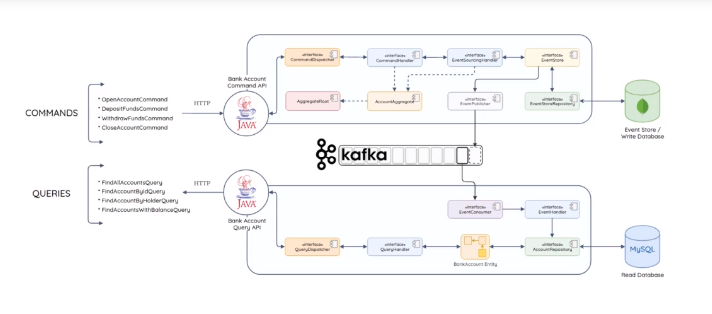

# CQRS

* Command Query Responsability Segregation (CQRS) es un patrón mediante el cual se separa la responsabilidad entre la gestión del comando y la consulta de los datos generados.
    * El comanto actualiza el estado de un objeto o entidad
    * La consulta obtiene el estado de un objeto o entidad
* Este patrón se justifica por los siguientes motivos:
    * Por lo general es más frecuente consultar datos que actualizarlos, o viceversa
    * Esta diferenciación permite optimizar el rendimiento de cada una de las partes
    * Ejecutar las dos operaciones en el mismo modelo puede generar "data contention"
    * Se puede manejar la seguridad de cada uno de ellos por separado.

* [Event-Sourcing](https://martinfowler.com/eaaDev/EventSourcing.html). Es una aproximación en la que todos los cambios hechos a un objeto o entidad se almacenan en un repositorio como una secuencia inmutable de eventos, en contraposición a guardar símplemente el estado de la entidad.
* Presenta las siguientes ventajas:
    * Proporciona un log completo de cada cambio de estado
    * El estado de un objeto o agregación puede ser reconstruidio reproduciendo la información de los eventos almacenados.
    * Mejora la ejecución de escrituras. Todos los tipos de eventos son simplemente anexados al almacen de eventos. No se realizan operaciones de actualización o borrado
    * En caso de fallo el repositorio de eventos puede utilizarse para reconstruir la BBDD de lectura.

* [Aggregate](https://martinfowler.com/bliki/DDD_Aggregate.html)
* Event-Store. Es una base de datos en la que se almacena una secuencia de eventos. Se deben tener en cuenta algunas caracterśiticas a la hora de diseñarlo:
  * Debe permitir solo operaciones de inserción, y consulta. No debe permitir acciones de actualización o borrado.
  * Cada evento almacenado representa una versión del estado de "agregado" en un momento temporal.
  * Los eventos se deben guardar cronológicamente, de forma que nuevos eventos sean "concatendados" a los anteriores.
  * El estado del "agregado" debe poder ser reconstruido a partir de los eventos registrados en el event-store
  * Debe implemntarse mediante un control optimista de la concurrencia.

* Ejemplo de arquitectura:

