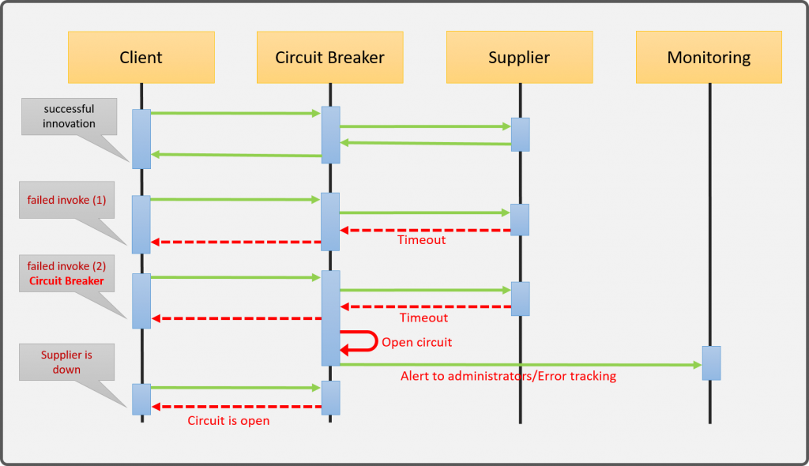
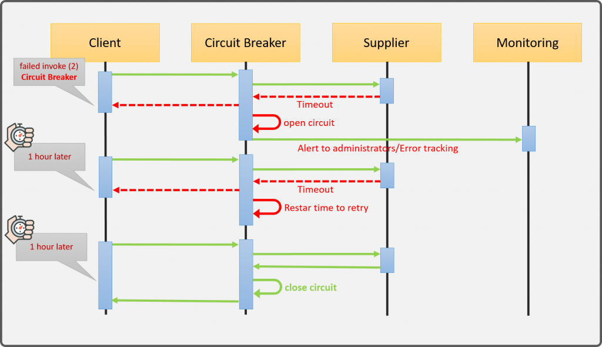
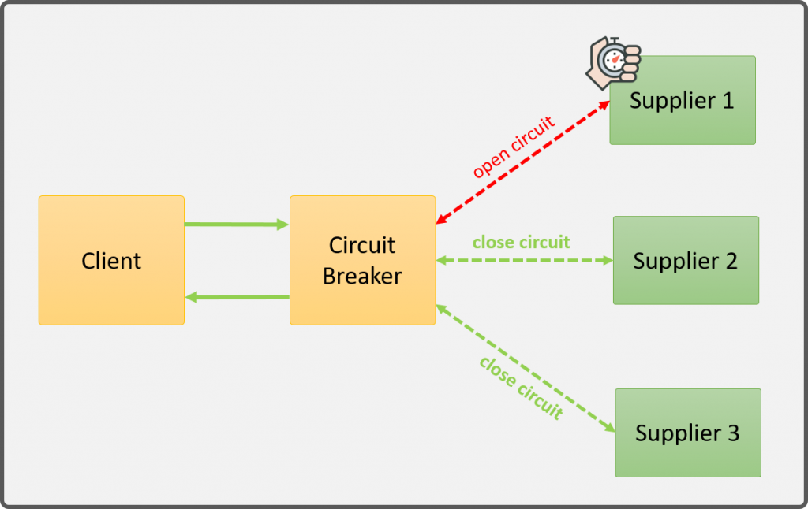
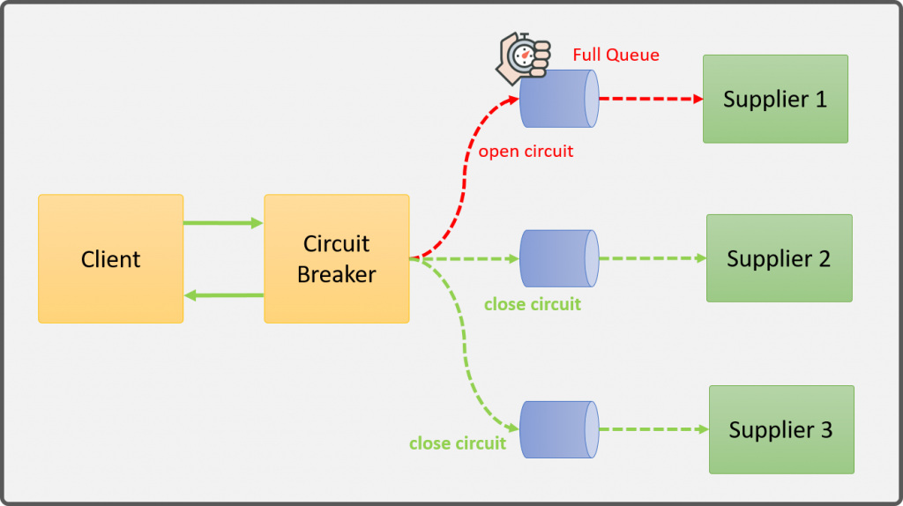

# Descripción

Es un patrón surgido dentro del ecosistema de arquitecturas SOA o microservicios, para dar respuesta a una problema específico, identificar cuándo un servicio ha dejado de funcionar y comportarse en consecuencia. Así pues su responsabilidad es:

* Identificar cuando un servicio ha dejado de funcionar
* Dejar de enviarle peticiones. Cerrar la comunicación con el servicio
* Informar del fallo

## Actores

Hay fundamentalmente 3 actore implicados, el client que solicitar un servicio al suplier y la capa intermedia de corto circuito. La clave aquí, es entender que el cliente no se comunica con el supplier directamente, sino que lo hace con el Circuirt Breaker que actúa como fachada.

## Comportamiento

Será más fácil de entender a partir del siguiente diagrama de secuencia:

En condiciones normales, el cliente invoca al Circuit Breaker, y éste, redirecciona la petición al supplier. A su vez, el supplier que también funciona correctamente, envía la respuesta al Circuit Breaker, y éste se la devuelve al cliente

Si embargo, cuando el cliente envía una petición, pero el Circuit Breaker recibe un error del supplier o se produce un timeout en la comunicación con éste, el Circuit Breaker toma nota del error. Gracias al manejo de un contador interno, determina cuántas veces ha fallador el supplier. No obstante, el Circuit Breaker redireccina el error al cliente.

Si a continuación, si se producen nuevas peticiones del cliente al Circuit Breaker, y el supplier falla un número de veces superior al permitido por el Circuit Breaker, éste determina que el supplier no está respondiendo de forma adecuada, retorna el error al cliente, y abre el circuito para que no se prodzcan nuevas comunicaciones.

Una vez abierto, tendríamos el siguiente funcionamiento:

Pasado un tiemo x (configurado) después de que el circuito se abrió, el Circuit Breaker redirecciona la siguiente petición al Supplier que estaba fallando para comprobar si ya se encuentra en funcionamiento.

Si tras redireccionar la petición el Supplier fallase de nuevo, el Circuit Breaker reinicia otra vez el contador, y espera el mismo tiempo x que antes.

Tras otro nuevo intento, y en caso de que el Supplier ya se encuentra operando correctamente, recibe la petición, la procesa y retornar exitosamente el Circuit Breaker detecta la respuesta exitosa del Supplier y cierra nuevamente el circuito.

## Circuit Breaker en arquitecturas distribuidas

Sin duda, este tipo de comportamiento, tiene sentido cuando nos encontremos en arquitecturas cloud con alta disponibilidad y escalamiento, en donde existen varias instancias del supplier.

Así que otra responsabilidad añadida del circuit breaker es la de redireccionar las peticiones a las instancias que estén respondiendo, mientras permanecen aisladas las que fallan.

## Ciclo de vida

Los estado que se pueden definir para el Circuit Breaker son 3:

* closed. Los supplier responden correctamente
* open. El servicio destino está fallando
* half-open. El componenete empieza a responder pero solo se le redirijen una pequeña cantidad de solicitudes para validar si el servicio está nuevamente activo.

Un caso especial de Circuit Breaker es el de arquitecturas SOA o de microservicios asíncronas en las que la comunicación se hace por medio de colas. 

En este caso, la fachada no puede determinar directamente en qué instante un supplier empieza a fallar, así que lo que se puede hacer es determinar el número de mensajes que tiene la cola, de forma que si alcanza un determinado umbral, se le dejan de dirigir peticiones para no saturar al supplier.

### Ventajas

* Monitoreo en tiempo real:
  
  * estado actual
  * tiempo de respuesta
  * frecuencia de fallo

* Sobrecarga. Evita tener muchos hilos esperando
* Tolerancia a fallo por el redireccinonamiento.